# Main

**TAIGER CONVERSE Administration Tool**

**User Guide - Release v2.6.X**

## 1 Introduction

### 1.1 Introduction

TAIGER Converse is a Conversation AI Platform that allows you to build and manage Bots \(also known as Virtual Assistants\). Bots are autonomous, always-on representatives of your business that can help service your Customers or Employees needs across a wide variety of scenarios. For example, a HR Bot can be configured to help your employees process their expense claims and a Customer Support Bot can help answer frequently asked questions and reset a customer's account password.

TAIGER Converse allows you to create engaging conversation experiences, and allow your customers & employees to become more productive. As chat has become ubiquitous and accessible to users of all skill levels, no training is required for end-users to interact with Bots you create.

This User Guide is meant for Administrators of Converse Bots, who will create, configure and train Bots to service the target end-users.

### 1.2 Basic Terminology

| **Term** | **Description** |
| :--- | :--- |
| Chat User | The target End-User \(e.g. Customer\) talking to your Bot on the Public Chat UI |
| Bot Admins | The Administrator utilising TAIGER Converse to build and manage Bots. |
| Admin Chat UI | The Chat Interface found within the Admin Tool, meant to be used for |
| Public Chat UI | The Chat Interface meant to be used by Chat Users |

## 

## 2 Home Page

### 2.1 Signing In

To sign in:

1. Open the browser to access the application.
2. Enter your login credentials.
3. Click **Sign in**.
4. Select the Converse Product Card.

_**Note:**_ _To reset password, click_ _**Did you forget your password?**. The user receives an email notification to reset the password._

### 2.2 Signing Out

To sign out:

1. Click on your user profile on the top-right corner and click Sign out.

## 

## 3 Intent & Libraries Management

Each Bot has multiple Intents, and Intents can be grouped into Libraries for better organization.

An Intent is a fundamental unit in Converse. It represents a piece of information the users can ask for, contains associated answers, and a part of a dialog. It is an intention conveyed in a user message which triggers some action. Each intent triggers a direct answer or guided conversational flow. A guided conversational flow is a series of actions linked together with a set of conditions and triggers another state of action \(see [Chapter 4: Intent & Dialog Building]()\)

Libraries are similar to folders where Intents can be kept. You can create new Libraries at any time, and move Intents between them.

### 3.1 Intent Dashboard

Intent Dashboard is the area where intents and libraries are displayed. This is where you can manage the intents assigned to your own bot.

It is divided into 3 main sections:

1. Bot Selector
2. Libraries Side Panel
3. Management and Teaching View

**A\) Bot Selector**

Bot Selector is located on the top left side of the navigation bar. It allows you to select the current active bot. Once the bot is selected, it will filter the available libraries assigned to your bot.

Select a _Current Active Bot_

* Displays current active Bot which you have Owner and Edit permissions
* Displays a list of libraries linked to the current active Bot

**B\) Libraries Side Panel**

This is where the list of libraries and number of intents assigned to the Current Active Bot can be seen.

#### 

### 3.2 Create Library

You can create a new Library by clicking on the  button in the Libraries Side Panel. The following Popup will appear:

<table>
  <thead>
    <tr>
      <th style="text-align:left">
        
      </th>
      <th style="text-align:left">
        
Enter Library Name (required)

        
Select the Bot you want to create the Library for.

        
Click &quot;Create&quot;

      </th>
    </tr>
  </thead>
  <tbody>
    <tr>
      <td style="text-align:left">
        
      </td>
      <td style="text-align:left">Then, the new Library will be created and displayed on the <em>Library Side Panel</em>
      </td>
    </tr>
  </tbody>
</table>

#### 

### 3.3 Default Libraries

When a Bot is first created, there will be 2 Default Libraries preloaded.

1. System Library
2. Smalltalk Library

#### 3.3.1 "System" Library - Configuring Default System Responses

This Library contains special Intents which are automatically triggered by Converse to support default system behaviour \(e.g. Initial ‘Hello’ message\).

Here are some of the important System Intents you should know:

<table>
  <thead>
    <tr>
      <th style="text-align:left"><b>Intent Name</b>
      </th>
      <th style="text-align:left"><b>When is it triggered?</b>
      </th>
    </tr>
  </thead>
  <tbody>
    <tr>
      <td style="text-align:left">Hello</td>
      <td style="text-align:left">When a first-time user opens the chat interface</td>
    </tr>
    <tr>
      <td style="text-align:left">Hello again</td>
      <td style="text-align:left">When a returning user opens the chat interface</td>
    </tr>
    <tr>
      <td style="text-align:left">NoInfo</td>
      <td style="text-align:left">When the Bot was not able to understand the user&#x2019;s Intent for the
        first time</td>
    </tr>
    <tr>
      <td style="text-align:left">NoInfo2</td>
      <td style="text-align:left">Following NoInfo, the Bot was not able to understand the user for the
        second time in a row</td>
    </tr>
    <tr>
      <td style="text-align:left">Escalate</td>
      <td style="text-align:left">
        
Following NoInfo2, the Bot was not able to understand the user for the
          third time in a row

        <ul>
          <li>Note: At this point, it is best practice to point the user towards some
            other means of getting help</li>
        </ul>
      </td>
    </tr>
    <tr>
      <td style="text-align:left">Bye</td>
      <td style="text-align:left">The intent that is triggered when the user says &quot;Bye&quot; or similar,
        or ends the conversation through any other means</td>
    </tr>
    <tr>
      <td style="text-align:left">Intent Search Fallback Template</td>
      <td style="text-align:left">This intent will be triggered when NLU Intent Matcher yielded low-confidence
        results.</td>
    </tr>
    <tr>
      <td style="text-align:left">WhatAbout Template</td>
      <td style="text-align:left">This intent is triggered when the user entered a topic based input, which
        matched one of the Topic Tags in the Bot&apos;s Ontology Knowledge Base</td>
    </tr>
  </tbody>
</table>

#### 

#### 

#### 3.3.2 "Smalltalk" Library

This Library contains a set of generic responses for common user inputs like

* "Who are you?"
* "Who made you?"
* "Are you a boy or a girl?"

By default, these Intents will be Deactivated. You can quickly activate them in bulk using the Bulk Intent Status Update function \(see [3.4.2.3 Bulk Change Intent Status]()\)

### 3.4 Management View

This is where the list of Intents of a selected library is displayed. In this area, you can manage and filter the intents, as well as to perform various actions such as create, edit, activate, deactivate, archive, unarchive and delete.

#### 3.4.1 Filter Intents in a Library

**3.4.1.1 Filter Intent by text search**

Enter any text here to search an Intent by text. The following Intent's properties will be searched:

* Intent Name
* All the Phrases of the Intent

**3.4.1.2 Filter Intents by Status**

By default, the system will filter for only _Active_ Intents. Other options include:

* Inactive
* Active and Inactive
* Archived

**3.4.1.3 Filter Intents by Tags**

* Tags allow you to organize your Intents by topic terms that are meaningful to you. To learn how to Tag Intents, see [3.4.2.4 Bulk Update Intents Tags]()
* Select the Tag that you want to filter Intents by clicking on the checkbox beside the tag
* You can select more than one tag to filter for at one go

**3.4.1.4 Reset Filters**

Click Reset Filters to reset all Filters to their default setting.

#### 3.4.2 Bulk Update Intents

**3.4.2.1 Bulk Select Intents for Update**

* Use the checkboxes on each Intent row to select the Intent for update

* You can also select All Intents on the Current Page, or All the Intents in the Library

**3.4.2.2 Bulk Move Intents**

* To move the selected Intents, click on the Folder  icon
* In the popup that appears, select the Destination Library for the Intents

**3.4.2.3 Bulk Change Intent Status**

* Click on the  Icon to change the selected Intents statuses
* In the popup that appears, select the Target Status for the Intents
* Click Update

**3.4.2.4 Bulk Update Intents Tags**

* Click on the  icon to tag the selected Intents
* In the popup that appears:
  * Add Tags: Search for Tags to add, then press enter
  * Remove Tags: Click on the 'x' button in the Existing Tags section. Note: this will only remove Tags from Intents that had the Tag to begin with.
* Now click on the Apply
* The Updated Tags should be visible in the Intent Dashboard, in the Tags column

#### 3.4.3 Bulk Import Q&A via Excel

You can bulk import Q&A using an Excel document to existing libraries by clicking  under Intent Dashboard &gt; Management View. This will generate the Intents and Phrases

Before proceeding you should prepare an Excel document with the following columns, adding your own Q&A into each row of the spreadsheet. A sample Q&A is provided in the example below:

<table>
  <thead>
    <tr>
      <th style="text-align:left">Question</th>
      <th style="text-align:left">Answer</th>
      <th style="text-align:left">Phrases</th>
    </tr>
  </thead>
  <tbody>
    <tr>
      <td style="text-align:left">What are your opening hours?</td>
      <td style="text-align:left">Our opening hours are 9am to 6pm, Monday to Friday.</td>
      <td style="text-align:left">
        
What are your opening hours?

        
When can I visit your office?

        
Another question variation

        
Yet another question variation

      </td>
    </tr>
  </tbody>
</table>

Notes:

* Ensure that column headers are exactly the same as the table above
* Specify each unique question variation on it's own line
* Each Q&A must have Question, Answer and at least one Phrase

**Bulk Import Steps:**

1. Select Library you wish to import into from the Library Side Panel.
2. Click on the  button. The Import popup for configuration and excel uploading will be displayed.

1. Select the status of the Intent after the import is complete.

* Draft - the Content only accessible on the Admin Chat UI, and is not visible to the Public
* Published - the Intent is immediately available for use on the Public Chat UI

1. Drag the Excel file containing the Q&A into the dotted box outline or click browse to upload the file.

Before you upload a file:

* Ensure the content label is always present at the top of the column. For example, “Question”.
* Ensure that the content label form has not been changed.
* Ensure not to upload an empty document.

1. Click . A new window displays the following:

* Bulk Import displays the uploaded excel file
* Intents imported with conflicting question text with other intents
* Preview of the list of imported intents for review

1. If there are conflicting question text with other intents, follow the instructions to resolve the conflicts.
2. Click Continue.
3. Review the content that you want to add in the library. 
4. A "Creating Intent" banner appears while the intents are being imported. Once done, the banner will disappear and your Intents would be imported successfully. 

### 3.5 Teaching View

The Teaching View is where you can train the bot with various phrases to match user’s utterances. Adding phrases is an alternative way of training the bot to ask questions or to understand a new form of questions.

In this view, displays a list of all the questions, answers, and added phrases that belong to that intent. You can also Teach the Bot to understand new variations of user input using the Teaching Tool.

Usage of the Teaching Tool and related functions will be explored in depth in the "The Teaching Tool" section \(see [Chapter 5: Teaching Your Bot to Understand Question Variations]()\)

## 

## 4 Intent & Dialog Building

### 4.1 Introduction to Intents

Intents refer to a Question and Response pair in Converse.

For a given Chat User query \(e.g. "Tell me about your products"\), the Converse Bot understands the user input using our proprietary Hybrid AI Intent Classifier, and _triggers_ the Intent that has the best response.

The Converse Bot is able to determine the right Intent to trigger if Intents have been configured with sufficient and diverse Phrases \(see [Chapter 5: Teaching Your Bot to Understand Question Variations]() to learn more about the teaching tool\)

When an Intent is triggered, the Bot replies to the Chat User with the Response configured on the Intent

### 4.2 Intent Response

* An Intent Response can have one or many steps that we call _States_
* In each Step, the Bot can act by sending a message to the user, or calling an external web service

<table>
  <thead>
    <tr>
      <th style="text-align:left">
        
<b>One State - Direct Answer</b>
        

        
A Chat User&apos;s question can be fulfilled by a single reply.

        
This is commonly used for FAQ Bots.

      </th>
      <th style="text-align:left">
        
      </th>
    </tr>
  </thead>
  <tbody>
    <tr>
      <td style="text-align:left">
        
<b>Multiple States - Guided Flow</b>
        

        
The response contains multiple steps.

        
This is required when the Bot needs more information from the Chat User
          before fulfilling the request.

        
This is typically used in more advanced Bots that can perform Transactions
          for Users.

      </td>
      <td style="text-align:left">
        
      </td>
    </tr>
  </tbody>
</table>

### 4.3 Intent Statuses

| **Status** | **Description** | **Intent is Editable** | **Triggerable in Admin Chat UI** | **Triggerable in Public Chat UI** |
| :--- | :--- | :--- | :--- | :--- |
| ACTIVE | Intent is ready to be shown to public users | Yes | Yes | Yes |
| INACTIVE | This is the default Status when an Intent is just created | Yes | Yes | No |
| ARCHIVED | Only Archived Intents can be deleted | No | No | No |

**Where to see an Intent's Status?**

1\) The Intent's Status can be viewed from the Intent Dashboard, in the Intent Listing table

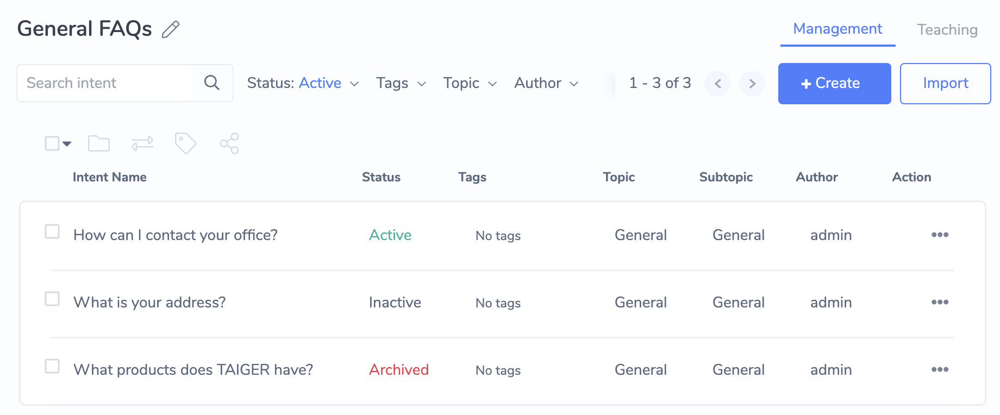

2\) It can also be viewed in the header section of the Intent Editor page for a specific intent

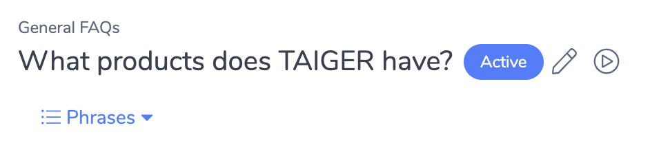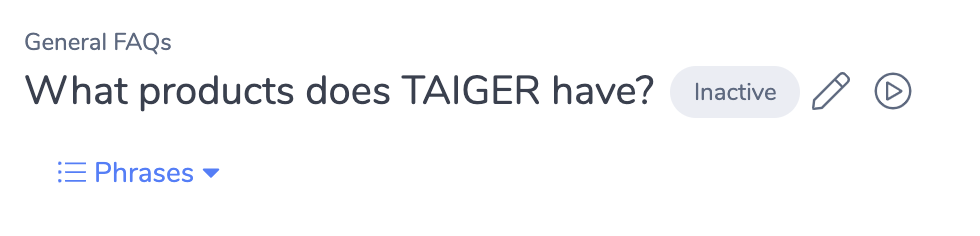

### 4.4 Intent Configuration

#### 4.4.1 Create Intent

1\) Start by clicking on the "+ Create" button on the Intent Dashboard &gt; Management View

2\) In the Popup that appears, enter in the following fields

<table>
  <thead>
    <tr>
      <th style="text-align:left">
        
<b>Intent Name:</b> Any memorable name will do. We recommend entering something
          Chat Users to say to trigger this Intent

        
<b>Library:</b> This should be pre-filled based on the Library you are
          currently viewing in the Intent Dashboard

        
<b>Tags (optional):</b> Tag with topic(s) so that you can search for it
          easier later

      </th>
      <th style="text-align:left">
        
      </th>
    </tr>
  </thead>
  <tbody></tbody>
</table>

3\) Click "Create"

4\) If the intent is successfully created, you will be brought to the Intent Editor page for your new Intent.

The Phrases Panel will appear to prompt you to add a Phrase. For now, just enter the same as the Intent Name and hit the _Enter_ key to add the phrase.

After adding the Phrase, you can close the Phrase Panel.

Great, you've successfully created your first Intent!

#### 4.4.2 "Quick-Test" Intent Trigger in the Admin Chat UI

To force-trigger an Intent, you can click the Quick-Test  button at Intent Editor's top section, which will trigger the Intent in the Admin Chat UI as shown below:

This will trigger the Intent in the Admin Chat UI, as though a Chat User had asked a question and triggered this Intent.

**Quick-Test Draft Version**

* If Quick-Test is used while the Intent Editor is in Edit Mode, then the Intent Response will be the DRAFT version of the Intent.
* When the Draft version is displayed, the text "\[DRAFT\]" appears before the Intent's name, and the Bot response message bubble is in a beige color.

**Quick-Test Published Version**

* If the Intent is Activated and the Intent Editor is not in Edit Mode, using the Quick-Test function will trigger the PUBLISHED version of the Intent.
* When the Published version is displayed, the message bubble is the regular color and the Bot response message bubble is in a grey color.

#### 4.4.3 Content Authoring with Draft and Published versions

Each Intent in Converse can have 2 possible versions - DRAFT and PUBLISHED.

This allows Bot Admins to author content on the Intent's Response without directly affecting what is shown to the Chat Users. Once the content authoring on the Draft version is complete, the Bot Admin can Publish the Draft version, thereby replacing the Published version.

#### 4.4.3 Edit Intent Details

1. Click the Pencil  button at Intent Editor's top section, as shown below:
2. This will open the Intent Details Popup, which allows you to change the following Intent Properties:
   * Intent Name
   * Library \(this will move the Intent to the specified Library\)
   * Tags
   * Short Intent Name \(controls what is displayed on the Button Link, if this Intent is referenced as a Related Intent - see [4.4.5.5 Related Intents]() to learn more\)

#### 

#### 4.4.4 Configuring an Intent's Response using the State Editor

* An Intent Response can have one or many steps that we call _States_
* In each State, the Bot can act by sending a message to the user, and / or calling an external web service

**4.4.4.1 View Only and Edit Mode**

If the Intent is ACTIVE, the State Editor will initially be in View Only mode, and the content for the PUBLISHED version is displayed. Click on the "Edit" button \(see image below\) to begin editing the DRAFT version.

If the Intent is INACTIVE, the State Editor will automatically be in Edit Mode and you can begin editing the DRAFT version immediately.

**4.4.4.1 State Editor Components**

**A\) Flow Diagram**

An Intent's States can be connected together into a Dialog _Flow,_ to give a multi-step response.

The Flow Diagram provides a visual representation of the Dialog Flow's structure. This is very useful especially for complex dialog flow structures with many States and pathways.

**Select a State for Editing**

The State Editor allows you to edit the States of the Dialog Flow. One State can be edited at any given time. Click on the Box / Node on the Flow Diagram to select the State.

The Selected State is filled in Blue like so: 

**Create a new State**

There are several ways to create a new State:

* Click on the circular "+" icon found below on every State's node on the Flow Diagram
* Click on the "+ Add State" button on the top-right hand corner of the Flow Diagram canvas.
* Create a new State while configuring a Message Component in the Content Editor

**B\) State Configuration Panel**

This panel displays the configuration options for the currently Selected State. Each of the available options are described in the next section.

#### 4.4.5 State Configuration Panel

**4.4.5.1 Name**

The State's Name is displayed on the State's Node on the Flow Diagram. It is best practice to give a meaningful name to describe the content or purpose of that State.

**State Blocks**

The State Configuration Panel contains State Blocks, each providing specific functionality when added to the State by clicking on the "+" button on the top-right hand side of each Block. Likewise, you can remove that functionality from the State by clicking on the "-" button.

Order of execution for State Block functionality

The functionality of each Block is executed in the same order as it is displayed on the UI. For example, the Service Action Block is executed before the Content Block. This means that data returned from the Service Action is accessible in the Content Block of the same State.

**4.4.5.2 Service Action Block \(for Semi-Technical Users\)**

Service Action allows you to call Converse Middleware Services or a Custom Webhook URL. See [Chapter 11: Data Integrations \(for Technical Users\)]() for a deep-dive into creating Converse Plugins or a Webhook.

| **Field** | **Description** |
| :--- | :--- |
| 1\) Service | Displays a list of available Services installed on the Converse Middleware. If "Webhook URL \(Custom\)" is selected, then the system expects a data payload that follows the specification found in [11.2 Configuring a Webhook Connector]() |
| 2\) Function | Displays a list of Functions available on the selected Service |
| 3\) Reference ID | Allows BotAdmins to define a unique identifying name for this Service call. This name will be used to reference this Service call so that information can be obtained about it, such as the data response from the external service called. |

4\) Inputs

After selecting the Function, each Input parameter required for this Function to run will be displayed as an input field. You can fill the Input Parameter using Context Variable or a hardcoded Text Value.

Here are some usage examples:

<table>
  <thead>
    <tr>
      <th style="text-align:left">
        
<b>Using Context Variable as inputs</b>
        

        
If you collected user input via the <a href>Data Collection block</a> OR
          retrieved data via other Service Actions, then you can set the Input Type
          to &quot;Context&quot; to utilize data stored in the Context.

      </th>
      <th style="text-align:left">
        
      </th>
    </tr>
  </thead>
  <tbody>
    <tr>
      <td style="text-align:left">
        
<b>Using Text Value as inputs</b>
        

        
If you want to use raw text as Input, you can set the Input Type to &quot;Text
          Value&quot;.

      </td>
      <td style="text-align:left">
        
      </td>
    </tr>
  </tbody>
</table>

5\) Outputs

The Outputs specify the data that the Function can return after it is executed successfully. This is defined by the developer who built the Middleware Service.

There are 2 types of Outputs:

<table>
  <thead>
    <tr>
      <th style="text-align:left">
        
<b>1) Data Outputs</b>
        

        
Referenced later using:

        
&lt;referenceID&gt;.<b>data</b>.numHits

      </th>
      <th style="text-align:left">
        
      </th>
    </tr>
  </thead>
  <tbody>
    <tr>
      <td style="text-align:left">
        
<b>2) Display Outputs</b>
        

        
Referenced in Dynamic Component using:

        
&lt;referenceID&gt;.<b>display</b>.hotelsCarousel

        
&lt;referenceID&gt;.<b>display</b>.hotelsButtonList

      </td>
      <td style="text-align:left">
        
      </td>
    </tr>
  </tbody>
</table>

Service Action Timeout

Service Action will wait up to 5 seconds before timing out. If you wish to configure the timeout value, please contact TAIGER Support.

Detecting a successful call and handling errors

Depending on success or failure of a Service call, Bot Admins will want their chatbot to send appropriate messages. The dialog structure is as follows:

**Detecting Errors**

If the Converse Plugin Function throws an error, Converse is notified via a reserved _**error**_ object on the Service Action response. The following properties are available in the _**error**_ object

| **Usage** | **Example** |
| :--- | :--- |
| &lt;referenceID&gt;.**error**.**code** | SERVICE\_ACTION\_TIMED\_OUT |
| &lt;referenceID&gt;.**error**.**message** | The Web Service took too long to respond |

Note that an Error's _**code**_ and _**message**_ can be configured by the Plugin's developer.

As such, we can set up Transition Conditions as follows so that the Dialog Engine reacts to the response success/error data from the Service Action.

**4.4.5.3 Content Block**

The Content block allows you to configure what your Bot says to the user.

We provide 2 Editors:

* **Legacy Editor:**
  * Supports HTML formatting \(bold, italics, etc\)
  * Not compatible with upcoming chat channels like Facebook Messenger
  * Does not support new features like Carousel and Button List
* **Modern Editor:**
  * Supports all new Message Components
  * Immediately compatible with Facebook Messenger
  * Does not support HTML formatting

We highly recommend using the Modern Editor \(enabled with a switch on the right side of the Content block\)

**Modern Editor - Message Components**

The Modern Editor allows you to compose Bot Responses using Message Components.

We currently support the following components:

<table>
  <thead>
    <tr>
      <th style="text-align:left"><b>Message Component</b>
      </th>
      <th style="text-align:left"><b>Example</b>
      </th>
    </tr>
  </thead>
  <tbody>
    <tr>
      <td style="text-align:left">Text Message</td>
      <td style="text-align:left">
        
      </td>
    </tr>
    <tr>
      <td style="text-align:left">Image</td>
      <td style="text-align:left">
        
      </td>
    </tr>
    <tr>
      <td style="text-align:left">
        
Quick Replies

        
Supports:

        <ul>
          <li>A Text Message</li>
          <li>Up to 13 Quick Reply buttons</li>
          <li>Button Name must be less than 20 characters</li>
        </ul>
      </td>
      <td style="text-align:left">
        
      </td>
    </tr>
    <tr>
      <td style="text-align:left">
        
Button List

        
Supports:

        <ul>
          <li>A Text Message</li>
          <li>Up to 5 buttons</li>
          <li>Button Name must be less than 20 characters</li>
        </ul>
      </td>
      <td style="text-align:left">
        
      </td>
    </tr>
    <tr>
      <td style="text-align:left">
        
Card

        
Supports:

        <ul>
          <li>An Image</li>
          <li>A Title</li>
          <li>A Description</li>
          <li>Up to 5 buttons</li>
          <li>Button Name must be less than 20 characters</li>
        </ul>
      </td>
      <td style="text-align:left">
        
      </td>
    </tr>
    <tr>
      <td style="text-align:left">
        
Carousel

        
A Carousel is a series of Card components.

        
Minimum number of cards: 1

        
Maximum number of cards 10

      </td>
      <td style="text-align:left">
        
      </td>
    </tr>
    <tr>
      <td style="text-align:left">
        
Dynamic Component

        
Dynamic Component allows us to display dynamically generated Message Components
          returned by Service Actions

      </td>
      <td style="text-align:left">For an example of how Service Actions and Dynamic Components are used
        together, please see <a href>4.4.12 Hands-on Guide: Building Transactional Flows with Service Action</a>
      </td>
    </tr>
  </tbody>
</table>

**Button & Quick Reply Configuration Options**

Buttons and Quick Replies provide prompts to the Chat User. Users can click on them to advance through the conversation.

Button Type

The Button Type allows Bot Admins to configure what clicking on the Button/QuickReply does.

| **Type** | **Description** |
| :--- | :--- |
| Trigger State | Advances the conversation to the specified State within the same Intent's Flow |
| Trigger Intent | Brings the Chat User to the specified Intent's Flow |
| Send Postback | Sends text on behalf of the Chat User to the dialog engine. By default, the text sent is the same as the Button Name. Bot Admins can configure a custom text value that is different from the Button Name. |
| Open URL | Opens a specified Web URL in a new browser window / tab. |
| Open Webview | Opens a specified Web URL in a Webview, which is an overlay on top of the Chat Interface. |

Button Concept

Set an _Ontology Concept_ on the Button to allow it to be triggered by Text Input.

<table>
  <thead>
    <tr>
      <th style="text-align:left">
        
If a new Ontology Concept is created, the Synonym Editor will pop up.

        
Bot Admins can define Synonyms of the Concept, which help the Bot match
          user inputs to the Ontology Concept.

      </th>
      <th style="text-align:left">
        
      </th>
    </tr>
  </thead>
  <tbody></tbody>
</table>

When a Chat User sends an input that matches any Synonym of the Button's Ontology Concept, the Button is triggered as though it was clicked.

**Typing Delay**

Each Component allows you to set a Typing Delay which simulates the Bot typing the response to the user. This delay allows Chat Users to read the previously displayed content before the new Message Component is displayed, and contributes to a better user experience.

**4.4.5.4 Data Collection Block**

Use this configuration to collect data from the Chat User. Data collected is stored in Variables in the Conversation Context, and can be used in following States.

<table>
  <thead>
    <tr>
      <th style="text-align:left"><b>Field Name</b>
      </th>
      <th style="text-align:left"><b>Description</b>
      </th>
    </tr>
  </thead>
  <tbody>
    <tr>
      <td style="text-align:left">Variable</td>
      <td style="text-align:left">Specify the Variable Name to store the value captured from the user input.</td>
    </tr>
    <tr>
      <td style="text-align:left">Variable Type</td>
      <td style="text-align:left">
        
This is the type of the variable that validates and restricts the user
          input to specific types: Date, Number, and File.

        <ul>
          <li>Number: Displays a number picker</li>
          <li>Date: Displays a date picker</li>
          <li>File: Displays a file picker
            <ul>
              <li>Note: Processing of uploaded files currently requires TAIGER customization
                effort. Please contact us if you&apos;d like to use this functionality.</li>
            </ul>
          </li>
        </ul>
      </td>
    </tr>
    <tr>
      <td style="text-align:left">Validation Type</td>
      <td style="text-align:left">
        
Validation type Indicates the type of validation to be applied on the
          user&apos;s input.

        
There are 5 possible validation types to choose from.

        <ol>
          <li>Number</li>
          <li>Date (DD/MM/YYYY)</li>
          <li>Date (MM/DD/YYYY)</li>
          <li>Email</li>
          <li>External Service - Use an External API service to validate the user&apos;s
            input (see <a href>11.1 Configuring a Webhook Connector</a> to learn more)</li>
        </ol>
        
For each of these types the following configuration options are provided:

        <ul>
          <li><b>Max Validation Attempts:</b> Specifies the number of times to try before
            triggering the <em>ValidationAttemptExceeded</em> State. This is to prevent
            the system from infinitely &quot;looping&quot;.</li>
          <li><b>Validation Attempts Exceeded State:</b> Specify the State to be triggered
            if the user exceeds the Max Validation Attempts. Use this State to provide
            more instruction to the Chat User, prompt the user to try again, or direct
            them to another Intent Dialog Flow.</li>
          <li> <b>Validation Message:</b> This is the message that will be triggered each
            time the user enters an input that fails the validation check, while within
            the Max Validation Attempts count.</li>
        </ul>
      </td>
    </tr>
    <tr>
      <td style="text-align:left">Validation Attempt (if validation type is selected)</td>
      <td style="text-align:left">
        
Specify the number of attempts allowed.

        <ul>
          <li>Maximum Attempts &#x2013; The number of attempts allowed for user input.</li>
          <li>Select Validation Attempt Exceeded State - The state that is displayed
            after the maximum number of has been exceeded.</li>
        </ul>
      </td>
    </tr>
    <tr>
      <td style="text-align:left">
        
Validation Message

        
(if validation type is selected)

      </td>
      <td style="text-align:left">The message being displayed to the user if the value submitted is invalid.</td>
    </tr>
  </tbody>
</table>

Basic Usage Example: Scenario - Collecting Email from a User

<table>
  <thead>
    <tr>
      <th style="text-align:left">This configuration will store the Email in the <b>userEmail</b> variable</th>
      <th
      style="text-align:left">
        
        </th>
    </tr>
  </thead>
  <tbody>
    <tr>
      <td style="text-align:left">
        
In the following State, The you can utilize the stored Variable in the
          Content Editor by using the syntax:

        
<b>%(answers.</b>VariableName<b>)</b>
        

      </td>
      <td style="text-align:left">
        
      </td>
    </tr>
  </tbody>
</table>

**4.4.5.5 Transitions Block**

Transitions define Conditions that are required to trigger a specific State.

It allows the Bot to "decide" what the next response should be, depending on the user input or the data currently in the conversation's Context \(see [4.4.2 Conversation Context]()\).

Order of Execution:

Transitions are executed in the same order which they are displayed \(from top to bottom\).

One way to understand it is in terms of if… then _rules_, as in:

 **IF** the chat user inputs &lt;concept&gt; **THEN** do &lt;action&gt;

Transition Types

<table>
  <thead>
    <tr>
      <th style="text-align:left"><b>Transition Type</b>
      </th>
      <th style="text-align:left"><b>Example</b>
      </th>
      <th style="text-align:left"><b>What it means</b>
      </th>
    </tr>
  </thead>
  <tbody>
    <tr>
      <td style="text-align:left">User Input</td>
      <td style="text-align:left">
        
      </td>
      <td style="text-align:left">
        
<b>IF</b> the chat user says &lt;Converse or something with the same meaning&gt;
          :

        <ul>
          <li><b>THEN</b> trigger the State with name &quot;Converse Details&quot;</li>
        </ul>
      </td>
    </tr>
    <tr>
      <td style="text-align:left">Context</td>
      <td style="text-align:left">
        
      </td>
      <td style="text-align:left">
        
<b>IF</b> the Service Call returned an error message

        <ul>
          <li><b>THEN</b> trigger the State &quot;Display Error Retrieving Hotels&quot;</li>
        </ul>
        
<b>ELSE IF</b> the <em>numHits</em> data property in the <em>getHotelsApi</em> Service
          call is exactly &quot;0&quot;:

        <ul>
          <li><b>THEN</b> trigger the State &quot;No Available Hotels&quot;</li>
        </ul>
        
<b>ELSE IF</b> the <em>numHits</em> data property in the <em>getHotelsApi</em> Service
          call exists:

        <ul>
          <li><b>THEN</b> trigger the State &quot;Display Available Hotels&quot;</li>
        </ul>
        
Available Comparisons*

        <ul>
          <li>Is true</li>
          <li>Is false</li>
          <li>Exists</li>
          <li>Equals to</li>
          <li>Not Equals to</li>
          <li>Contains</li>
        </ul>
      </td>
    </tr>
    <tr>
      <td style="text-align:left">Fallback</td>
      <td style="text-align:left">
        
      </td>
      <td style="text-align:left">
        
<b>IF</b> none of the Transitions in the State triggered

        <ul>
          <li><b>THEN</b> trigger the State &quot;Confirmation&quot;</li>
        </ul>
      </td>
    </tr>
  </tbody>
</table>

\*For Information for Middleware Plugin Developers:

Only String Comparisons are supported. For Numeric value, convert it into a text value first \(i.e. 0 becomes "0"\). For Boolean values, convert it into text value \(i.e. "true" or "false"\).

Transition Actions

Transitions can lead Chat Users to a State within the same Intent Flow, or trigger another Intent entirely. In the input field under the "Then Go To" label, Bot Admins can select either State or Intent to select which Action the Transition should take.

**4.4.5.6 Set Context Action Block**

Set Context Action allows Bot Admins to set new or existing Variables in the Context.

Context Variables can then be used in Transition's conditions, sent to external services via Service Action, or inserted into Message Components to be displayed to Chat Users.

If the Context Variable already exists, then the value it holds will be overwritten with the new value. If Context Variable does not exist, then it will be created.

<table>
  <thead>
    <tr>
      <th style="text-align:left"><b>Function</b>
      </th>
      <th style="text-align:left"><b>Usage Example</b>
      </th>
    </tr>
  </thead>
  <tbody>
    <tr>
      <td style="text-align:left">
        
Set Context Variable to a Text Value

        
<b>Example:</b>
        

        
Set the variable <em>favouriteCity</em> to the Text value &quot;BALI&quot;

      </td>
      <td style="text-align:left">
        
      </td>
    </tr>
    <tr>
      <td style="text-align:left">
        
Set Context Variable to another existing variable (reassignment)

        
<b>Example:</b>
        

        
Set the variable <em>userFirstName</em> to the value in the variable <em>answers.firstName</em>
        

      </td>
      <td style="text-align:left">
        
      </td>
    </tr>
  </tbody>
</table>

**4.4.5.7 Dialog Settings**

Dialog Settings allow Bot Admins to configure advanced dialog behaviors. These settings change the way the Dialog Engine behaves for the specific state.

<table>
  <thead>
    <tr>
      <th style="text-align:left">Jump Intent</th>
      <th style="text-align:left">
        
If this is configured, then when this State is triggered, the Chat User
          is brought to the specified Intent&apos;s Flow.

        
We recommend using Trigger Intent functionality found in Button/QuickReply
          and Transitions (available in v2.6.0+).

        
Important Notes:

        <ul>
          <li>If Jump is setup, the Content configuration in the State is <b>ignored</b>
          </li>
          <li>If the Jump destination Intent must be ACTIVE. If it becomes INACTIVE/ARCHIVED,
            the Jump will not process, and the Chat User will stay in the current Intent&apos;s
            Dialog Flow.</li>
        </ul>
      </th>
    </tr>
  </thead>
  <tbody>
    <tr>
      <td style="text-align:left">Ready to Reply</td>
      <td style="text-align:left">
        
Default Value: <b>true</b>
        

        
If true:

        <ul>
          <li>The State&apos;s Content field will be returned as a reply to the Chat
            User</li>
          <li>If there were any preceding States that have not sent their Content to
            the user, their Content will be prepended to this State.</li>
        </ul>
        
If false:

        <ul>
          <li>The dialog will proceed to the next State without sending the State&apos;s
            Content to the Chat User.</li>
        </ul>
      </td>
    </tr>
    <tr>
      <td style="text-align:left">Advance</td>
      <td style="text-align:left">
        
Default Value: <b>true</b>
        

        
Indicates whether the dialog engine should advance to the next State or
          stay in the current state.

      </td>
    </tr>
  </tbody>
</table>

#### 4.4.6 Activating an Intent

You should make the majority of content edits to your Intent while it is still INACTIVE.

Once the Intent is ready to be shown to the Public, click on the "Activate Intent" button in the Intent Editor page

Now, you will be able to trigger this Intent from the Public Chat UI.

#### 4.4.7 Making Content Edits while the Intent is Activated

To make content edits to an Activated Intent

* Click on the Edit button in the Intent Editor. This will enable the "Edit Mode"
* While In Edit Mode, changes are saved to a "Draft" version, and not immediately visible on the Public Chat UI. However, you can still test your changes using the _Quick-Test_ function.
* Once you are done with the changes, you can Publish them by clicking on the "Publish" button on the top-right side of the "Edit Mode" interface

Note: While the Intent is INACTIVE, Edit Mode enabled by default, so you are always editing the "Draft" version of the Intent.

#### 4.4.8 Deactivating an Intent

When an Intent's response is no longer relevant and you want to disable it from being triggered on the Public Chat UI, you should Deactivate it.

1. In the Intent Editor, click on the "..." button on the top right side of the screen
2. In the menu that appears, click on "Deactivate Intent"

#### 4.4.9 Archiving an Intent

If you do not intend to Reactivate an Intent, you can Archive it for future reference. This is a good way to "clean-up' your Bot's Knowledge Base by keeping only relevant Intents at the foreground.

To Archive an Intent, it must first be INACTIVE

1. In the Intent Editor, click on the "..." button on the top right side of the screen
2. In the menu that appears, click on "Archive Intent"

#### 4.4.10 Unarchiving an Intent

1. In the Intent Editor, click on the "..." button on the top right side of the screen
2. In the menu that appears, click on "Unarchive Intent"

#### 4.4.11 Deleting an Intent

To delete an Intent, it must first be Archived.

1. In the Intent Editor, click on the "..." button on the top right side of the screen
2. In the menu that appears, click on "Delete Intent"

#### 

### 4.4.2 Conversation Context

In simple terms, the Conversation Context can be seen as the "short term memory" of the chatbot when it is having a conversation with a Chat User.

**4.4.2.1 Data Collection Scenario**

Having this "Short Term Memory" is essential when engaging in conversation, because it allows the Bot to remember and use information previously provided by the Chat User.

In figure above, the Data Collected from the user is stored in the Conversation Context and then reiterated back to the Chat User. The Bot then uses the stored data to call an external API service to fulfill the customer's request.

Data Collected from the Chat User can be inserted into Message Components using the syntax **%\(answers.**&lt;variableName&gt;**\)**. For examples of how this is used, please refer to [4.4.5.4 Data Collection Block]()

4.4.2.2 Service Action Scenario \(for Technical Users\)

The Conversation Context also stores data returned from External Services, called via Service Action \(see [4.4.5.2 Service Action Block]()\)

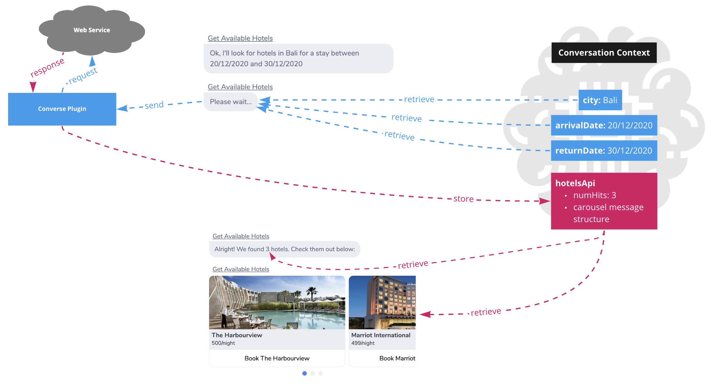

In this scenario:

* The data collected from the Chat User is retrieved from the Conversation Context and sent to the Converse Plugin \(via Service Action\)
* The Converse Plugin formats the data and sends it as a request to the Web Service
* The response data from the Web Service is transformed by the Converse Plugin, and then stored in the Conversation Context \(via Service Action\)
* The Data from the Web Service can then be retrieved from the Conversation Context to be displayed to the Chat User, or used within conditional logic inside Transitions.

For a detailed example of how Service Action is used to create such API-driven Transactional Flows, please see [4.4.4 Hands-on Guide: Building Transactional Flows with Service Action]()

### 

### 4.4.3 Admin Chat UI - Info Panel

When creating Guided Flows it is often useful to see the data stored in the Conversation Context. To do so, you can use the Admin Chat Info Panel feature.

**4.4.3.1. Toggle the Info Panel**

Click on the "..." menu button on the top-left of the Admin Chat header, and then click on the "Show Info Panel" item. You can use the same menu item to hide the Info Panel.

**4.4.3.2. Usage Scenarios**

<table>
  <thead>
    <tr>
      <th style="text-align:left"><b>Scenario</b>
      </th>
      <th style="text-align:left"><b>Example</b>
      </th>
    </tr>
  </thead>
  <tbody>
    <tr>
      <td style="text-align:left">
        
<b>Inspect Data Collected from User</b>
        

        
In this scenario, the first State asks the Chat User &quot;What city would
          you like to go to?&quot;, and also has the Data Collection block activated
          to collect the user&apos;s reply in the <em><b>city</b></em> variable.

        
After the Chat User replies with &quot;Bali&quot;, this value is stored
          in the Conversation Context in the <em><b>city</b></em> variable

      </td>
      <td style="text-align:left">
        
      </td>
    </tr>
    <tr>
      <td style="text-align:left">
        
<b>Inspect Service Action Inputs and Outputs</b>
        

        
When executing external services via Service Action, it is useful to see
          what is being sent to the Service as <em>Inputs</em> and what is being returned
          in the response as <em>Data</em> and or <em>Display</em>
        

        
Learn more about Service Action at <a href>4.4.5.2 Service Action Block</a>
        

      </td>
      <td style="text-align:left">
        
      </td>
    </tr>
    <tr>
      <td style="text-align:left">
        
<b>Inspect Service Action Errors</b>
        

        
As errors can occur in Service calls, Service Action provides error handling
          capabilities.

        
If an error occurred, you will see the Error Code and Message on the Info
          Panel.

      </td>
      <td style="text-align:left">
        
      </td>
    </tr>
  </tbody>
</table>

### 4.4.4 Hands-on Guide: Building Transactional Flows with Service Action

Transactional Conversation Flows are interactions with the Bot that require calling one or more external web services in order to fulfill the Chat User's request.

Some examples of Transactional Flows include:

* Making an appointment booking with a Customer Support Representative
* Submitting an Insurance Claim
* Resetting an user account's password

Converse makes it straightforward to execute custom functionality that performs performs web service calls and run computation logic by providing:

* Converse Plugin SDK \(Java\)
* Converse Middleware, which serves as a Plugin Manager to host compatible Plugins

For details on how the Plugin Architecture works and how to build custom Plugins, please see [11.1 Converse Middleware Plugins]()

This guide provides instructions for building a Flow that provides available Hotels for a given city, an arrival date and a return date. Note: You will need the "Flights And Hotels" Plugin to be installed on the Converse Middleware to follow through this guide. This should come as standard with Demo/Sandbox Converse installation for testing purposes.

<table>
  <thead>
    <tr>
      <th style="text-align:left">
        
<b>Step 1</b>
        

        
Navigate to the Intent Management page

        
Create a new Intent called

        
<b>&quot;Get Available Hotels&quot;</b>
        

      </th>
      <th style="text-align:left">
        
      </th>
    </tr>
  </thead>
  <tbody>
    <tr>
      <td style="text-align:left">
        
<b>Step 2</b>
        

        
Add a phrase to the intent and hit Enter

        
Then close the Phrase Panel

      </td>
      <td style="text-align:left">
        
      </td>
    </tr>
    <tr>
      <td style="text-align:left">
        
<b>Step 3</b>
        

        
In the first State do the following:

        
Change State Name to &quot;<b>Collect City</b>&quot;

        
Add 2 Text Message components to the State and enter in the content in
          the screenshot on the right

        
Add the Data Collection block and set the <em>variable</em> field to &quot;<b>city&quot;</b>
        

      </td>
      <td style="text-align:left">
        

          
        

        

          
        

      </td>
    </tr>
    <tr>
      <td style="text-align:left">
        
<b>Step 4</b>
        

        
In the Graphical Editor, click on the
          button in the under the State Node

        
In the Popup that appears, enter &quot;<b>Collect Arrival Date</b>&quot;.

        
Click Save to Create the new State

      </td>
      <td style="text-align:left">
        
      </td>
    </tr>
    <tr>
      <td style="text-align:left">
        
<b>Step 5</b>
        

        
In the newly created

        
<em>&quot;Collect Arrival Date&quot;</em> State:

        
Add a Text Message Component with the text: <b>&quot;What&apos;s your arrival date?&quot;</b>
        

        
Add the Data Collection block and set the <em>variable</em> field to &quot;<b>arrivalDate&quot;</b>
        

        
<b>----</b>
        

        
Now, follow the same process in Step 4 and create a new State named: &quot;<b>Collect Return Date</b>&quot;

      </td>
      <td style="text-align:left">
        
      </td>
    </tr>
    <tr>
      <td style="text-align:left">
        
<b>Step 6</b>
        

        
In the newly created

        
<em>&quot;Collect Return Date&quot;</em> State:

        
Add a Text Message Component with the text: <b>&quot;What&apos;s your return date?&quot;</b>
        

        
Add the Data Collection block and set the <em>variable</em> field to &quot;<b>returnDate&quot;</b>
        

        
<b>---</b>
        

        
Now, follow the same process in Step 4 and create a new State named: &quot;<b>Call Service</b>&quot;

      </td>
      <td style="text-align:left">
        
      </td>
    </tr>
    <tr>
      <td style="text-align:left">
        
<b>Step 7</b>
        

        
Great! Now you have set up the Flow to collect all the required user inputs.
          Now, we will configure the Service call via Service Action block

        
In the newly created

        
<em>&quot;Call Service&quot;</em> State:

        
Add a Service Action Block and set it up like the screenshot on the right.

        
Note that the Reference ID of the Service Action is set to &quot;<b>hotelsApi</b>&quot;.
          This reference ID will be used in future steps.

      </td>
      <td style="text-align:left">
        
      </td>
    </tr>
    <tr>
      <td style="text-align:left">
        
<b>Step 8</b>
        

        
In the <em>&quot;Call Service&quot; State:</em>
        

        
Set the Text Message component&apos;s text to &quot;<b>Getting available hotels&#x2026;</b>&quot;
          to inform the Chat User that processing is ongoing.

      </td>
      <td style="text-align:left">
        
      </td>
    </tr>
    <tr>
      <td style="text-align:left">
        
<b>Step 9a</b>
        

        
In the <em>&quot;Call Service&quot; State:</em>
        

        
Add a Transition that checks if an error has occurred in the Service Action

        
This is done by checking the <b>error.message</b> property of the Service
          Action exists.

        
If this condition is true, then the Transition will trigger.

      </td>
      <td style="text-align:left">
        
      </td>
    </tr>
    <tr>
      <td style="text-align:left">
        
<b>Step 9b</b>
        

        
Now complete setting up the Transition by specifying the Destination State
          to go to if the Transition&apos;s Condition is true.

        
Click on &quot;+ Add New State&quot; in the dropdown to create a new Destination
          State.

        
In the Popup that appears, enter the State Name as &quot;<b>Failure</b>&quot;

        
Click Save to create the new State.

      </td>
      <td style="text-align:left">
        

          
        

        

          
        

      </td>
    </tr>
    <tr>
      <td style="text-align:left">
        
<b>Step 9c</b>
        

        
Verify that the Transition has been set up like the screenshot on the
          right.

      </td>
      <td style="text-align:left">
        
      </td>
    </tr>
    <tr>
      <td style="text-align:left">
        
<b>Step 10</b>
        

        
In the <em>&quot;Call Service&quot; State:</em>
        

        
Create another Transition to check if there were no results found

        
To do so, check if the <em>numHits</em> property in the data object is equal
          to <b>0</b>.

        
Note: We know there is a <em>numHits</em> data property because it is specified
          in the Plugin Function&apos;s Data Outputs (see Step 7)

      </td>
      <td style="text-align:left">
        
      </td>
    </tr>
    <tr>
      <td style="text-align:left">
        
<b>Step 11</b>
        

        
In the <em>&quot;Call Service&quot; State:</em>
        

        
Scroll to the bottom of the State Editor to find the Dialog Settings panel.

        
Toggle <b>OFF</b> Ready To Reply

        
This tells the Dialog Engine to evaluate the Transitions and trigger the
          next State without waiting for a User Input.

      </td>
      <td style="text-align:left">
        
      </td>
    </tr>
    <tr>
      <td style="text-align:left">
        
<b>Step 12</b>
        

        
Click on the &quot;<em>Failure</em>&quot; State in the Graphical Editor
          to edit it.

        
Set the Text Message component with the content shown on the right.

      </td>
      <td style="text-align:left">
        
      </td>
    </tr>
    <tr>
      <td style="text-align:left">
        
<b>Step 13</b>
        

        
Click on the &quot;<em>No Available Hotels</em>&quot; State in the Graphical
          Editor to edit it.

        
Set the Text Message component with the content shown on the right.

      </td>
      <td style="text-align:left">
        
      </td>
    </tr>
    <tr>
      <td style="text-align:left">
        
<b>Step 14</b>
        

        
Click on the &quot;<em>Display Hotels</em>&quot; State in the Graphical
          Editor to edit it.

        
Set the Text Message component with the content shown on the right.

        
Note: We can use the <em>numHits</em> property in the Text Message Component
          by surrounding it with a %()

        
Add a Dynamic Component, and set the value with the content shown on the
          right.

        
Here, we are displaying the Message Component(s) dynamically generated
          by the Converse Plugin Function. In this case, it is a Carousel Component
          containing a list of Hotels.

      </td>
      <td style="text-align:left">
        
      </td>
    </tr>
  </tbody>
</table>

**Step 15**

Test the flow! Scroll up to the Intent Header, and click on the Quick-Test icon on the right side of the Intent Name.

Use the Admin Chat UI's Info Panel to view Data Collected or Data sent to/from Service Action

To open the panel, click on the "..." on the top-left side of the Admin Chat Header \(as below\).

|  |  |
| :--- | :--- |

**Step 16**

**Activate the Intent** by clicking on the "Activate Intent" button at the top-right side of the page.

The Intent Status label should now be "Active"

You're all done! You just successfully created a Transactional Flow using Service Action.

Using the process described in this guide, we can build complex conversational processes involving multiple Service calls, and weave dynamic data and static dialog content into a smooth conversational experience.

## 

### 4.4.5 Collect User Input via Variable Capture \(NER\)

We can extract an entity from user utterance, and add it into the Dialog’s Context’s to be utilized in preceding States of the triggered Intent.

**Example**

The following screenshot shows an example of Variable Capture in action, where the entity on the user utterance was extracted, and printed in the response to the user message.

**4.4.5.1. How To Set Up Variable Capture**

**1\) Ensure that the Class exists in the Ontology**

Click on the Ontology tab on the navigation bar to access the Ontology Manager.

Note that only defined ontology elements can be extracted. Taiger or it’s certified partners’ knowledge engineers will build the Ontology, based on the domain of the FAQ data set.

A Class is a generalized grouping of Entities \(e.g. “Fruit”\) An Individual is a child of a Class \(e.g. “Apple”\)

Since we have the “Fruits” Class in the Ontology, we can set up Variable Capture to recognize and extract Fruit entities from user utterances.

**2\) Set Up an Intent’s phrases for variable capture**

Create an Intent if you have not already done so.

Navigate to the **Intent Dashboard &gt; Teaching** to view the phrases for each Intent.

In the teaching tool, we can specify several variations of how we expect the users to ask questions. We also specify the location where the entity is expected.

Variable Capture syntax is as follows:

$variableName@ClassName

Add the following Phrases:

**3\) Utilize the captured variable in the Intent's States**

Navigate to the Intent Editor for the Intent you created, the edit first State's Content:

<table>
  <thead>
    <tr>
      <th style="text-align:left">
        
      </th>
      <th style="text-align:left">
        
You can use the captured variable with the syntax <b>%(&lt;variableName&gt;)</b>
        

        
The variable name was specified in Step 2.

        
The Entity captured is by default, an element in the Ontology, which has
          a Unique Identifier (URI). This identifier allows us to reference the exact
          ontology element, if needed.

        
Typically, what we would want to use in responses to the chat user is
          the short name (a.k.a Label) of the Ontology element.

        
To use the Ontology element&#x2019;s Label, you should specify <b>%(&lt;variableName&gt;Label)</b>
        

      </th>
    </tr>
  </thead>
  <tbody></tbody>
</table>

**4\) You're all done! Check that your Bot responds in the following ways:**

## 

## 

## 

## 

## 5 Teaching Your Bot to Understand Query Variations

### 5.1 Accessing The Teaching Tool

**Navigating to the Teaching Tool**

The Teaching Tool can be found at two places:

1\) In the Intent Dashboard, select the "Teaching" tab on the top right of the screen.

2\) In the Intent Editor, Click on the "Phrases" button on the top left of the screen.

### 5.2 Adding and Deleting Phrases

Usage of the Teaching Tool in the Intent Dashboard and the Intent Editor is very similar.

**Toggle the Phrase Input Field \(only for Intent Dashboard's Teaching Tool\)**

From the Intent Dashboard, the Phrase Input Field is hidden by default, so you need to toggle it by clicking on the "+" button. This step is not required for the Teaching Tool inside the Intent Editor because the Phrase Input Field is open by default.

**Add Phrases**

With the Phrase Input Field open, you can start adding Phrases.

You can add multiple phrases at one go by having one phrase on each line.

Once you are done, press "Enter" on your keyboard and the phrases will be added sequentially to the Intent.

Note: It is recommended to have at least 10 Phrases per Intent. See [5.6 Best Practices To Improve Intent Matching Accuracy]()

**Deleting Phrases**

To delete a phrase, click on the trash bin icon beside the Phrase.

### 

### 5.3 Phrase Status Indicator

This indicates whether or not the Phrase is correctly triggering the Intent.

When a Phrase is added, it is automatically Tested, and the Phrase Status Indicator is updated.

Here are the available statuses and their meanings:

<table>
  <thead>
    <tr>
      <th style="text-align:left"><b>Status</b>
      </th>
      <th style="text-align:left"><b>Icon</b>
      </th>
      <th style="text-align:left"><b>Description</b>
      </th>
    </tr>
  </thead>
  <tbody>
    <tr>
      <td style="text-align:left">Pass</td>
      <td style="text-align:left">
        
      </td>
      <td style="text-align:left">The Phrase is working as expected. No action is necessary.</td>
    </tr>
    <tr>
      <td style="text-align:left">Not Tested Yet</td>
      <td style="text-align:left">
        
      </td>
      <td style="text-align:left">
        
The Phrase is not yet tested. This can happen if the Phrase was added
          automatically through other processes.

        
Action: Click &quot;Test All Phrases&quot; to manually test the phrases

      </td>
    </tr>
    <tr>
      <td style="text-align:left">Conflict</td>
      <td style="text-align:left">
        
      </td>
      <td style="text-align:left">
        
The Phrase is triggering the wrong Intent. This should never happen if
          the system is working correctly.

        
Steps to rectify: Click &quot;Test All Phrases&quot; and see if the Status
          was updated incorrectly. If the error persists, please contact TAIGER support.

      </td>
    </tr>
  </tbody>
</table>

### 5.4 Testing Phrases

**Test Phrases For An Intent**

Testing Phrases will update the Phrase Status Indicator, and is useful for a quick health-check for that Intent.

**Test All Bot Phrases**

You can also run a Bot-level health check which will test all Phrases for all the Intents in the Current Active Bot. To access this function:

1. Navigate to the Intent Dashboard &gt; Teaching tab
2. Click on the '...' icon on the top right side of the page, under the Teaching Tab element
3. In the menu that appears, click on the "Test" option

This will start the Testing Process, and a popup will appear that summarizes the results in real time:

### 5.5 Training Your Bot

After you have finished adding Phrases to your Intents, it is time to Train your Bot. This allows your Bot to learn from the Phrases added and generalize better and handle even more variations of user input. This means you don't need to think of all the possible variations - Converse automatically handles them for you.

Note: Depending on the number of Intents & Phrases added to your Bot, this process can take several minutes to complete. It is best to Train your bot once you are done with Phrase changes for your work session.

To start the Training Process:

1. Navigate to the Intent Dashboard &gt; Teaching tab
2. Click on the '...' icon on the top right side of the page, under the Teaching Tab element
3. In the menu that appears, click on the "Train" option

1. A "Training in Progress" banner appears while the training process is running. Once done, the banner will disappear.

### 5.6 Best Practices To Improve Intent Matching Accuracy

Do’s

* Recommended for higher accuracy: 10 or more phrases. Minimum: 7 phrases
* Ensure that each Intent has about the same number of Phrases. Having some intents with very few phrases will skew the AI's understanding of the Intents
* Express questions, NOT keywords \(“How can I contact you” vs “contact you”\)
  * Unless your users ask questions using keywords – do study conversation logs to determine this
* **Make real variations!** Use a combination of synonyms and differing sentence structures to express the same question
* Visualize the target audience – how will they ask questions?
* Play “Jeopardy”! – Try to guess the question by looking only at the Answer

Don’ts

* Phrase questions in a way that is too similar to an existing Intent
* Use filler words: \(e.g. “hello, I would like to…”\)

## 6 Unhandled Phrases Management

Managing unhandled phrases allows you to quickly view common phrases asked by the users that the VA could not confidently answer. It allows you to manage previous conversation data to resolve these unhandled phrases by either creating new intent or assigning the phrases to an existing intent.

In addition, you can group these phrases that are similar so it can be processed as a batch. These phrases are sorted by the system based on the total frequency of occurrences.

You can mark a phrase as invalid for those out of scope or spam user inputs. Furthermore, you can undo or revert invalid phrases back to unhandled for further verification.

In the Unhandled Phrases Manager, phrases are categorised into three categories:

1. Unhandled – Phrases that the bot was unable to handle
2. Resolved – Previously unhandled phrases that has been assigned to an intent
3. Invalid – Previously unhandled phrases deemed to be invalid

The manager also displays the number of times each category of phrases appeared in conversations.

There are 3 main steps to process unhandled phrases.

1. Identifying and “marking” invalid unhandled phrases
2. Identifying and grouping phrases with same intents
3. Resolving the unhandled phrases

### 6.1 Managing Invalid Unhandled Phrases

To begin processing unhandled phrases, it is important to first identify and “mark” and invalid phrases. Phrases are considered Invalid if any of the following is being identified:

* Phrase is a single term OR could mean many things \(vague phrasing leads to errors and lower accuracy\). For example, “want to go”, the bot responds “that’s kind of vague…can you please rephrase?”.
* There is a spelling error in the phrase. Do not teach the system with broken spelling, unless it is a common spelling error.
* There is more than one intention in the phrase \(Multiple intents = vague!\).
* It is not phrased as a question. For example, feedback from the user.

#### 6.1.1 Marking Phrases as Invalid

1. Navigate to the Unhandled Phrases tab. A list of all unhandled phrases for the selected bot will be displayed.
2. For each phrase, you will be able to view each conversation log by selecting the phrase. The conversation log will allow you to review the context of conversation which led to the unhandled phrase.
3. You can also see the number of times each unhandled phrase appeared in conversations.

1. Click the button. Upon clicking, the system will attempt to group the unhandled phrases together based on their meaning.
2. Once the intents are grouped, toggle the  switch to **ON**. The checkboxes for the intents and their parent group will turn red.
3. Start “marking” invalid intents by checking the checkboxes. 
4. To confirm “marking”, click on the  button. A pop-up window will be displayed asking for confirmation. Select **Yes** to confirm “marking”.
5. Toggle the  switch to OFF.

#### 6.1.2 Viewing Invalid Phrases

To view invalid phrases, select the  phrases tab on the left hand panel of the unhandled phrases manager. All phrases marked as invalid will be displayed. For invalid phrases, you will be able to:

1. View each conversation log by selecting . The conversation log will allow you to review the context of conversation which led to the unhandled phrase.
2. Revert invalid phrases to become “unmarked”.

#### 6.1.3 Reverting Invalid Phrases

To revert previously resolved unhandled phrases:

1. Under the Actions column for the selected phrase, click the  button.
2. A pop-up window will appear asking for confirmation of reversion for the selected phrase.

### 6.2 Resolving Unhandled Phrases

Now that you have removed the invalid phrases, the next step will be to teach the system to understand the remaining phrases by resolving them.

#### 6.2.1 Selecting Phrases with the Same Intents for Resolving

1. Select the  phrases tab on the left hand panel of the unhandled phrases manager.
2. For each group of unhandled phrases, select the unhandled phrases with the same intent by checking the Blue Checkboxes of each phrase. You can also select all phrases at once by clicking on the first checkbox.
3. Repeat **Step 2** for each group of unhandled phrases.

#### 

#### 6.2.2 Resolving by Adding to Existing Intent

To resolve the selected unhandled phrases within each group, select the button on the top-right corner of the group. A pop-up window is displayed with the following sections:

1. Phrase\(s\) Involved – This section displays the list of phrases that you selected and want to resolve.
2. How to Resolve? – This section allows you to select the method you wish to resolve the selected unhandled phrases with.

The Add phrase to existing intent option will be selected by default. For this option, the system will suggest a list of existing intents segregated into 3 categories to choose from.

* Suggested by AI – This intent is suggested by the system \(AI engine\).
* Suggested both by User & AI – This intent is suggested by the system based on user feedback.
* Manually searching for a suitable intent.

For each listed intent, you can view and edit the intent details by clicking .

To resolve phrases with this method,

1. Select one from the suggested intents or search for an intent by name. If there is no suitable existing intent, skip this step and click Create new intent for this phrase.
2. Click the  button. Once done, the resolved unhandled phrases will be moved to the Resolved section.

#### 6.2.3 Resolving by Creating New Intent

To resolve the selected unhandled phrases within each group, select the 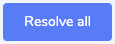 button on the top-right corner of the group. A pop-up window is displayed with the following sections:

* Phrase\(s\) Involved – This section displays the list of phrases that you selected and want to resolve.
* How to Resolve? – This section allows you to select the method you wish to resolve the selected unhandled phrases with.

For phrases with no suitable existing intent, you will need to create a new intent for these phrases. To resolve phrases with this method,

1. Select the **Create new intent for this phrase** option.
2. Add a name for the new intent.
3. Select a library.
4. Click the  button. Once done, the resolved phrase is immediately added to the newly created intent and taught to the bot. These phrases will then be moved to the Resolved section.

#### 6.2.4 Viewing Previously Resolved Phrases

To view previously resolved phrases, select the  tab on the left hand panel of the unhandled phrases manager. All resolved phrases will be displayed and you will be able to:

1. View each conversation log by selecting . The conversation log will allow you to review the context of conversation which led to the unhandled phrase.
2. Revert resolved phrases.

#### 6.2.5 Reverting Previously Resolved Phrases

To revert previously resolved unhandled phrases:

1. Under the Actions column for the selected phrase, click the  button.
2. A pop-up window will appear asking for confirmation of reversion for the selected phrase.

## 

## 7 Chat Analytics

The Chat Analytics component of Converse provides real-time information about the system usage. It allows you to view data concerning metrics revolving around engagement, user performance, user satisfaction & user statistics. These data can be filtered by several customizable parameters, such as the time period, bot, or delivery channel.

### 7.1 Overview

The overview page shows the chatbot active users trend and chatbot performance. To navigate the Analytics page, select the  button on the navigation bar

#### 7.1.1 Filter Panel

The analytics page shows data for ALL bots by default. To access the filter, select the  button on the top right hand corner of the page. The filter panel will slide in from the right.

<table>
  <thead>
    <tr>
      <th style="text-align:left">
        <ol>
          <li>Sort by Bot</li>
        </ol>
        
To filter the analytics data by bots, select the particular bot by expanding
          the dropdown panel. The dropdown panel will display all the bots you have
          permission to.

        <ol>
          <li>Sort by Delivery Channel</li>
        </ol>
        
To filter the analytics data by delivery channel, simply check the relevant
          checkboxes.

      </th>
      <th style="text-align:left">
        
      </th>
    </tr>
  </thead>
  <tbody></tbody>
</table>

#### 

#### 

#### 7.1.2 Chatbot Usage Trend

This graph shows the data trend lines for:

* New Users \(Red Trend Line\) - Unique first time users of the chatbot.
* Returning Users \(Blue Trend Line\) - A returning user.
* Total Users \(Green Trend Line\) - Total number of new users and returning users.

You can specify the date range to filter the data and the frequency for day, week, or month. You can also filter the bot and delivery channel used.

#### 7.1.3 Chatbot Performance

The Chatbot Performance displays an overview of the top-level metrics that indicate the performance of the bot over the specified period in the Date Range Filter.

Changes in metrics are expressed in either percentages or the absolute value, with the change being obtained by comparing this period vs the last period. For example:

* If the Date Range filter is set from 7 to 7 May \(1 day\), the period to compare with is 6 - 6 May \(1 day\)
* If the Date Range filter is set from 8 to 14 May \(7 days\), the period to compare with is 1 - 7 May \(7 days\).
* If the Date Range filter is set from 1 to 31 May \(31 days\), the period to compare with is 31 March - 30 April \(31 days\).

The following metrics are covered and shown as “cards” on the chatbot performance page:

#### 

<table>
  <thead>
    <tr>
      <th style="text-align:left"><b>Name</b>
      </th>
      <th style="text-align:left"><b>Interpretation</b>
      </th>
      <th style="text-align:left"><b>Description</b>
      </th>
    </tr>
  </thead>
  <tbody>
    <tr>
      <td style="text-align:left">Total Users</td>
      <td style="text-align:left">Higher is better</td>
      <td style="text-align:left">The quantity of users who talked with the chatbot (does not need to be
        unique users)</td>
    </tr>
    <tr>
      <td style="text-align:left">Chatbot Rating</td>
      <td style="text-align:left">Higher is better</td>
      <td style="text-align:left">The average chatbot rating received</td>
    </tr>
    <tr>
      <td style="text-align:left">Deflection Rate</td>
      <td style="text-align:left">Lower is better</td>
      <td style="text-align:left">
        
The percentage of conversations where the user:

        <ul>
          <li>obtained a useful answer or;</li>
          <li>had significant activity,</li>
        </ul>
        
AND

        <ul>
          <li>the Escalate intent was not triggered</li>
        </ul>
      </td>
    </tr>
    <tr>
      <td style="text-align:left">Chatbot Rating</td>
      <td style="text-align:left">Higher is better</td>
      <td style="text-align:left">The average chatbot rating received</td>
    </tr>
    <tr>
      <td style="text-align:left">Total Fallback Count</td>
      <td style="text-align:left">Lower is better</td>
      <td style="text-align:left">The total number of instances where the system was not able to understand
        the user</td>
    </tr>
    <tr>
      <td style="text-align:left">Avg Session Duration</td>
      <td style="text-align:left">Higher is better</td>
      <td style="text-align:left">The average duration from Session Start to Session End</td>
    </tr>
    <tr>
      <td style="text-align:left">Overall Confusion</td>
      <td style="text-align:left">Lower is better</td>
      <td style="text-align:left">The percentage of interactions where the system was not able to understand
        the user</td>
    </tr>
  </tbody>
</table>

### 7.2 Engagement

The engagement component of analytics consists of data regarding how the user interacted with the bot. To access this page, select the  tab on the left hand panel of the analytics page.

#### 7.2.1 User Activities

This metric shows the overall usage in terms of total number of sessions \(conversations\) and messages sent by the user.

**7.2.1.1 No of Session**

The total number of sessions occurs in a given day. It is the sum of all conversations that was conducted between 0000hrs and 2359hrs for a given day.

**7.2.1.2 Average Duration**

The average duration is calculated as the Total Session Duration / No. of Sessions

**7.2.1.3 Messages Sent**

The total number of messages sent by users and the bot.

#### 7.2.2 Deflection Rate

The deflection rate represents the percentage of conversations where the user obtained a useful answer or had significant activity, and the Escalate intent was not triggered. In essence, it signifies the rate at which a user question / query was fulfilled without needing the help of a live agent.

The deflection rate is calculated by comparing the conversations that had occured in the current period against the conversations from the previous period. Hence, the deflection rate is dependent on the date range selected.

<table>
  <thead>
    <tr>
      <th style="text-align:left">Deflection Rate</th>
      <th style="text-align:left">
        
Deflection describes the scenario where the user was able obtain to useful
          answer(s) from the chatbot, which may have resulted in him/her not asking
          the physical customer support helpdesk for help (Escalate was reached)

        
Deflection Rate % = ( No. of Helpful Conversations + No. of Conversations
          with significant activity ) / Total Conversations

      </th>
    </tr>
  </thead>
  <tbody>
    <tr>
      <td style="text-align:left">No Activity</td>
      <td style="text-align:left">
        
No. of Conversations with No Activity is the Total Conversations:

        <ul>
          <li>WITHOUT No. of Conversations that Escalated</li>
          <li>WITHOUT No. of Helpful Conversations</li>
          <li>WITHOUT No. of Conversations with significant activity</li>
        </ul>
      </td>
    </tr>
    <tr>
      <td style="text-align:left">Escalation Enquiries Reached</td>
      <td style="text-align:left">Sum of total conversations in which there was at least 1 message that
        was escalated</td>
    </tr>
    <tr>
      <td style="text-align:left">Marked an Answer as helpful</td>
      <td style="text-align:left">
        
No. of Helpful Conversations within a period is:

        
Sum of conversations in which there was at least 1 system message rated
          to be useful by users

      </td>
    </tr>
  </tbody>
</table>

#### 

#### 

#### 

#### 

#### 

#### 7.2.3 Conversations

This component captures the conversation with users, alongside with metadata such as conversation ID, start, end, duration of conversation. Conversations can be filtered by clicking on the  button. You can also mass export all conversation data as an excel spreadsheet by clicking on the button.

**7.2.3.1 Viewing Individual Conversations**

You can view the individual conversation history by clicking on the  button under the action column for each conversation. A conversation history pop up will then appear, alongside its relevant metadata and export functionality.

### 

### 7.3 Content Performance

The following metric cards are shown in the content performance page:

| **Name** | **Interpretation** | **Description** |
| :--- | :--- | :--- |
| Total Fallback Count | Lower is better | The total number of instances where the system was not able to understand the user |
| Overall Confusion | Lower is better | The percentage of interactions where the system was not able to understand the user |
| No. of Message Sent by User | Higher is better | No. of Message Sent by User |
| Total No. of Answer Rated Helpful | Higher is better | Total No. of Answer Rated Helpful |

#### 

#### 

#### 

#### 7.3.1 Flow Diagram

This page shows the detailed content performance for a specific Intent in the form of a flow diagram. To access the flow diagram, click on the “View Flow Diagram” option.

The following metric cards are shown in the each individual flow diagram page:

| **Name** | **Interpretation** | **Description** |
| :--- | :--- | :--- |
| Times Asked | Higher is better | The number of times this Intent was triggered |
| Fall Completion Rate | Higher is better | The percentage of instances where the user reached the final state of the Intent's dialog flow |
| Fallback Count | Lower is better | The number of occurrences where the user said something unexpected while progressing within this Intent's dialog flow |
| Confusion Rate | Lower is better | The percentage of interactions where the system was not able to understand the user, while handling this Intent |
| Positive Rating | Higher is better | The number of instances where a user marked an answer within this flow as correct by clicking on the "tick" icon |

**Interpreting the Flow Diagram:**

<table>
  <thead>
    <tr>
      <th style="text-align:left"><b>Name</b>
      </th>
      <th style="text-align:left"><b>Image</b>
      </th>
      <th style="text-align:left"><b>Description</b>
      </th>
    </tr>
  </thead>
  <tbody>
    <tr>
      <td style="text-align:left">State Cards</td>
      <td style="text-align:left">
        
      </td>
      <td style="text-align:left">Shows the number of times a particular subsequent state was triggered.</td>
    </tr>
    <tr>
      <td style="text-align:left">Exit Reason Popover</td>
      <td style="text-align:left">
        
      </td>
      <td style="text-align:left">Shows the number of drop offs. Drop Offs are instances where the user
        did not continue using the chatbot (and allowed the session to expire)
        immediately after this State.</td>
    </tr>
    <tr>
      <td style="text-align:left">State Card Popover</td>
      <td style="text-align:left">
        
      </td>
      <td style="text-align:left">
        <ul>
          <li><b>Income</b>: The number of users who reached the state.</li>
          <li><b>Outcome</b>: The number of users who completed the state.</li>
          <li><b>Drop offs</b>: The number of users who dropped off from the state.</li>
        </ul>
      </td>
    </tr>
    <tr>
      <td style="text-align:left">Flow Lines</td>
      <td style="text-align:left">
        
      </td>
      <td style="text-align:left">Shows the number and percentage of users moving from one state to the
        others.</td>
    </tr>
  </tbody>
</table>

### 7.4 User Satisfaction

| **Name** | **Interpretation** | **Description** |
| :--- | :--- | :--- |
| Average Rating | Higher is better | The average rating score based on the feedback given via the Feedback “stars” rating \(1-6\) |

## 

## 8 Common Space Management

### 8.1 Overview and Configuration

#### 8.1.1 What is Common Space

The Common Space allows Organizations to share Intents with other Organizations on the same Converse installation. The business objectives here are:

* Encourage Knowledge Reuse within the organization
* Create a single-source-of-truth for better knowledge management

#### 8.1.2 Configuring Common Library Types

There are two Common Library Types

* "Restricted" Type - Only specified Contributors can share to these Libraries
* "Open" Type - Any Bot Admin can share Intents to these Libraries

Each Library Type can also be given a custom name, e.g. "Policy" Library or "Community" Library.

Converse supports creating any number of Restricted and Open Library types. This needs to be set up at deployment time. Please contact a TAIGER or TAIGER Technical Partner representative for more information.

### 8.2 Common Space Administration

#### 8.2.1 Creating Common Libraries

1. Navigate to the  tab of the navigation bar.
2. Select the on the library side panel. The following Popup will appear:
3. Fill in the library name and assign the intended library type. The library type shown depends on what was configured beforehand \(see 8.1.2 [Configuring Common Library Types]()\)
4. Click 

#### 8.2.2 Managing Contributor Access for Restricted Libraries

Note: You need to have Super Admin access to use this feature.

From the Common Space page, click on the '...' icon on the top-right corner of the screen

In the popup that appears, you will be able to add/remove Bot Admins from your own Organization as Contributors to the Restricted Library. Only Contributors are allowed to share Intents to Restricted Libraries.

### 8.3 Sharing Intents to Common Libraries

You can choose to share intents from your library to common libraries. To do so, you will first need to navigate to the library of intents you want to share.

1. Select the intents you want to share by checking their individual checkboxes.
2. Click on the  button to initiate the sharing process. The following pop-up window will appear:

1. Select the library in the common space that you would like to share the selected intents to and click  to confirm.

### 8.4 Importing Common Intents

You can also import common intents from community libraries into your libraries.

1. Navigate to the  tab of the navigation bar.
2. Select the community library from the Libraries Side Panel that contains the common intents you would like to import.
3. Select the intents you want to import by checking their individual checkboxes.
4. Click on the  button to initiate the importing process.

Select Bot & Library

1. Select the bot and library you would like to export the selected intents to
2. Configure the settings for the import

* Auto-Sync - Turn on if you want the exported intent to be automatically updated if the original intents are updated.
* Follow Intents - Turn on to receive notifications should there be any changes made to the original intents.
* Publish Immediately - Turn on to activate intents immediately after they have been added to your bot.

Resolving Conflicting Intents

In the event that similar intents and phrases already exist in the library, you will need to resolve the conflicts to continue with the import. Deconflicting will be done on the conflict resolution wizard. The wizard will show the following information:

1. List of the conflicting intents to be resolved
2. Intent from the common space
3. Existing intent from the library

Phrases / Intents that are in direct conflict will be lighted in red.

#### 8.4.1 Resolving Conflicts

Conflict Scenarios

There are three possible conflict types occurring when importing intents.

1. Intent Name conflict
2. Phrase conflict
3. Intent Name and Phrases conflict

For each of these scenarios there are a few ways to resolve:

**8.4.1.1 Change the Intent Name**

* Navigate to the existing intent in the library.
* Click on the  icon. The intent name will now become an editable field.
* Edit the intent name and press the “enter” key to save changes.
* After the intent names have been deconflicted, they will no longer be in red font. The alert bar on top will turn green and show the following:

**8.4.1.2 Deconflict the Phrases**

* The system is flagging the Phrases that are found in both Intents in red font.
* To resolve this, Exclude or Delete the conflicting Phrase\(s\) from either the Intent From Common Space OR the Existing Intent, respectively. You can do so by clicking on the icon on the right-side of each Phrase
* After the Phrases have been deconflicted, the alert bar on top will turn green.

**8.4.1.3 Replace the Existing Intent**

**8.4.1.4 Remove the Intent from being imported**

* To remove the intent, click on the  icon for the intent being imported.

Once all conflicts are resolved, click on the button to continue. A summary page of the changes being made will be displayed.

Click on the  to confirm import.

### 

### 

### 

### 8.5 Managing Imported Intents

Once intents from the common space are imported, you will be able to view them in their parent libraries. Imported intents will be earmarked with the name of the community library that it was imported from. Click on the imported intent to manage it.

#### 

#### 8.5.1 Switch Auto-Sync Setting

Use the  switch to manage the Auto-Sync setting.

#### 8.5.2 Editing Imported Intents

To edit Imported intents, you will need to turn off auto-sync. Once auto-sync is turned off, the input fields for the State Configuration Panel will be activated.

## 9 Bot Management

Bot Administrators can manage the bot by creating bot or multiple bots and assigning libraries for each bot, together with the access role and permissions.

The Bot Manager page is where you can manage the bots and access rights.

To access the Bot Manager:

1. Click on your user profile on the top-right corner and click Bots.

1. A list of existing bots will appear. To manage a bot, click on its name. You will then be redirected to the Edit Bot page.

### 9.1 Creating New Bot

To create a new bot:

1. On the Bot Manager page, click . A pop-up window will be displayed asking for the Bot Name.
2. Enter the name in the **Bot Name** field and click on .

1. Once the bot is created, select it to view the bot details. You can edit the name of the bot clicking theicon.
2. Click on the  and the bot created will appear in another browser tab. You can also click  and paste it to another browser tab to display the new created bot.

1. After clicking  or pasting the link into another browser tab, the bot will appear as shown below.

### 9.2 Edit Bot Name

To editing bot name, simply navigate to the

1. Select the bot from the bot manager page to navigate to the Edit Bot page.
2. Click on theicon beside the bot name to enable editing.

1. Enter the new name for the bot and press the enter button on the keyboard to save changes.

### 9.3 Embedding Bot on Webpage

To embed the bot to another HTML page:

1. Select the bot from the bot manager page to navigate to the Edit Bot page.
2. Copy the Chat Widget Embedding Code Snippet in the **Embedding Instructions** section by clicking on the button.

1. Paste the code after the &lt;HEAD&gt; tag of the HTML page and before &lt;/HEAD&gt; tag.

1. Now, open the HTML file to a web browser and the new bot displays.

### 9.4 Bot Options

In the Edit Bot page, you can configure the Bot in the following tabs:

#### 9**.4.1 Libraries**

The area where you add and assign libraries to the Bot.

As an Administrator, you can assign libraries as long as you have Owner/Edit permissions assigned to you by the Super Administrator.

#### 9.4.2 Administrators

The area where you assign roles and permissions for access to the bot. By default, the user who created the bot has the Owner permission. You add or remove users to the bot by clicking on the  and  button respectively.

<table>
  <thead>
    <tr>
      <th style="text-align:left"><b>Roles</b>
      </th>
      <th style="text-align:left"><b>Permissions</b>
      </th>
    </tr>
  </thead>
  <tbody>
    <tr>
      <td style="text-align:left">Owner</td>
      <td style="text-align:left">
        
- Able to Add and Remove Administrators

        
- Able to edit the permissions assigned for the bot.

      </td>
    </tr>
    <tr>
      <td style="text-align:left">Edit</td>
      <td style="text-align:left">Can manage all Content for the Bot - Edit Libraries, Intents, Manage Unhandled
        Phrases, etc (See <a href>12.4 Roles and Access Rights</a> for details)</td>
    </tr>
    <tr>
      <td style="text-align:left">Read Only</td>
      <td style="text-align:left">Can only view the Bot&apos;s Content - no edit rights are given.</td>
    </tr>
  </tbody>
</table>

#### 9.4.3 Default Bot Configuration \(for Technical Users\)

The tab where you can update the default bot configuration to edit the bot widget’s behavior and functionality.

These are the options available for editing:

**9.4.3.1 Bot Name**

| **Type** | **String** |
| :--- | :--- |
| **Default** | **&lt;Bot Name&gt;** |

Use this value to override the Bot Name used throughout the chat interface.

 

**9.4.3.2 Input Placeholder**

| **Type** | **String** |
| :--- | :--- |
| **Default** | **‘Type here to start chatting…’** |

Placeholder text for the main input field in the chat widget footer.

**9.4.3.3 Idle Delay Time \(Minutes\)**

The amount of minutes that the chat can be idle before a confirmation dialog will pop up prompting the user to continue or close the chat.

**9.4.3.4 Idle Message Title**

| **Type** | **String** |
| :--- | :--- |
| **Default** | **‘You have been away for awhile…’** |

Title text shown on the confirmation dialog.

**9.4.3.5 Idle Message Body**

| **Type** | **String** |
| :--- | :--- |
| **Default** | **‘Would you like to continue the session?’** |

Body text shown on the confirmation dialog.

**9.4.3.6 Avatar Visibility**

Toggle the visibility of the chat avatar in the Chat Header.

**9.4.3.7 Autocomplete Visibility**

Toggle visibility of the panel of autocomplete suggestions that appear when the user starts typing.

**9.4.3.8 Feedback Message**

| **Type** | **String** |
| :--- | :--- |
| **Default** | **‘👋 Did this help?’** |

Message that shows up at the bottom of each chat bubble that is sent from the Bot.

**9.4.3.9 After Feedback Message**

| **Type** | **String** |
| :--- | :--- |
| **Default** | **‘🙏 Thanks for your feedback’** |

Message that shows up at the bottom of each chat bubble after the tick or cross is clicked.

**9.4.3.10 Landing Page Toggle**

Toggles a landing page that shows up when the chat widget starts. This can also and should be configured in the ‘Landing Page’ Tab in the Bot Editor.

**9.4.3.11 Feedback Panel Option Visibility**

Displays the Feedback Option in the Dropdown Menu

**9.4.3.12 Feedback Panel - Stars Rating Label**

| **Type** | **String** |
| :--- | :--- |
| **Default** | **Please leave a rating!** |

**9.4.3.13 Feedback Panel - Comments Label**

| **Type** | **String** |
| :--- | :--- |
| **Default** | **Any Comments?** |

**9.4.3.14 Feedback Panel - Comment Placeholder**

| **Type** | **String** |
| :--- | :--- |
| **Default** | **Please tell us how we can improve :\)** |

**9.4.3.15 Automatic Chat UI Popup Delay \(Milliseconds\)**

| **Type** | **Integer** |
| :--- | :--- |
| **Default** | **undefined** |

Set this to a positive Integer to activate the Popup Delay in Milliseconds. The Chat UI interface will open after the defined milliseconds have elapsed.

**9.4.3.16 Automatic Chat UI Popup On First Visit**

Set this to true to make the Chat UI open automatically for first time visitors to the website.

#### 

#### 

#### 

#### 

#### 9.4.4 Avatar Image

The tab where you can change the Avatar image of the bot.

#### 

To upload a new avatar image:

1. Click the button. The Upload Avatar window will be displayed.
2. To upload, either drag and drop the image into the dropbox or click on the dropbox to select an image from your directory.
3. Ensure that the image is a PNG file with a minimum size of 64x64 px and maximum size of 128x128 px.

You can preview the newly uploaded image under the Preview Section.

1. Click  to save the uploaded image. Otherwise, click cancel.

#### 

#### 9.4.5 Landing Page \(for Technical Users\)

The tab where you can customize the Public Chat UI landing page.

1. Use the HTML and CSS editor to add your code for the landing page.
2. Toggle Turn On to switch if you want the landing page to appear in the chat UI.
3. Click .

1. Click **Preview** to preview the landing page.

#### 

#### 9.4.6 Asset Library

The area where you can store and manage content or assets used by the bot such as images, videos, logos, and so on.

* The total storage limit of this asset library is 10MB.
* The size limit for each file is 1MB.

To upload, either drag and drop the image into the dropbox or click on the dropbox to select an image from your directory.

## 

## 10 Ontology Management

### 10.1 View Ontology

To view the Ontology for the Current Active Bot, click on the Ontology link in the navigation bar.

Click on one of the displayed Classes to view the Individuals within them.

The Ontology view will be loaded as such:

**Note:** if you do not see a list of Classes, you may need to Load Ontology \(see [10.2 Load Ontology]()\)

### 

### 

### 

### 10.2 Load Ontology

When the Bot is newly created, no Ontology will be present yet, and the page will be empty.

To load up the default Ontology:

1. Click on the 'Actions' button on the top-right corner of the page
2. Click on "Load Ontology"
3. Within a few seconds, the Default list of Classes will appear

### 

### 10.3 Creating New Individual

Classes contain child Ontology elements, called "Individuals"

You can create a new Individual for a class by:

1. Click on one of the Classes in the list
2. Click on the "+ Create New Individual" button
3. In the "Create an Individual pane" that opens, specify

<table>
  <thead>
    <tr>
      <th style="text-align:left">
        
#label (required): The unique identifier of the Ontology element

        
#altLabel (optional): A list of synonyms or related words to describe
          this Ontology Element. You can add more than one by clicking on &quot;+
          Add new Value&quot;

        
#definition (optional): Detailed descriptions of this Ontology element

      </th>
      <th style="text-align:left">
        
      </th>
    </tr>
  </thead>
  <tbody></tbody>
</table>

1. Click "Save"
2. The Individual is created, and displayed in the list of Individuals

### 

### 

### 10.4 Editing Individual and Property Values

To edit the Individual:

* Click on the Edit button to access the Editor

* To remove a Property Value, click on the 'X' button on the right-side of the value
* To add a new Property Value, click the "+ Add new value" button under the list of Property Values
* Click "Save" to update the Individual

### 10.5 Deleting Individuals

To delete an Individual, click on the 'X' icon on the Individuals listing

Please take care while doing this as it cannot be undone.

### 10.6 Export Ontology

To export the Ontology for the Current Bot click on the "Actions" button on the top-right of the screen, and select Export Ontology.

* A **.ttl** file will be downloaded
* Save this file as a backup of your Ontology
* You can also Import this Ontology into another Bot by using the Import Ontology function in the next section.

### 10.7 Import Ontology

To export the Ontology for the Current Bot click on the "Actions" button on the top-right of the screen, and select Import Ontology.

* In the file picker, select the **.ttl** file
  * Note: the .ttl file should have been previously exported via the Export Ontology function
* The Bot's Ontology should now be loaded with the new Ontology elements

### 10.8 Train Ontology

After Adding or Removing Individuals from the Ontology, you'll need to Train Ontology so that the Converse AI Engine can pick up changes made.

After running "Train Ontology", you'll still need to execute "Train Bot" in the Intent Dashboard so that the AI Engine can also process the Intents and Phrases.

**Tip:** You can also skip "Train Ontology" and proceed directly to "Train Bot", since "Train Bot" also checks for changes to the Ontology automatically.

## 

## 11 Data Integrations \(For Technical Users\)

### 11.1 Converse Middleware Plugins

From v2.6.0, the Converse Platform provides a Middleware that allows developers to deploy reusable Plugins to serve as Connectors to other web services, and/or run any custom computation logic. Plugins are Java \(JAR\) programs that can be seamlessly executed by the Dialog Manager. Each Dialog State can be configured to execute a Plugin's functionality via the Service Action State Block \(see [4.4.5.2 Service Action Block]() to see usage details\).

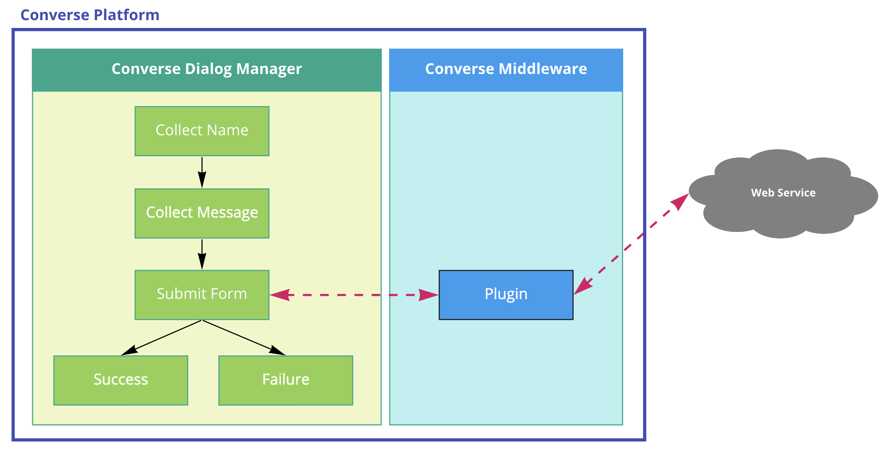

For details on how to create a Converse Middleware Plugin, you may reference the documentation [here on Github](https://github.com/taigers/converse-plugins/blob/master/md/src/SUMMARY.md). This repository also provides sample Plugins to kickstart your development process.

### 11.2 Configuring a Webhook Connector

Here you can configure Webhook Connector for the bot to call upon reaching the state. Webhook Connectors are Web Services or API Endpoint that receives a JSON payload from Converse, and synchronously responds with data that can be utilized by Converse in the Dialog Sequence.

A Webhook Connector can be implemented in any programming language or platform. It simply needs to expose an endpoint that receives a JSON request body, and responds with data as specified in this document

To specify the web service to be triggered by the Dialog Engine, provide the URL in the Service Action Block of the State Editor.

Example:

### 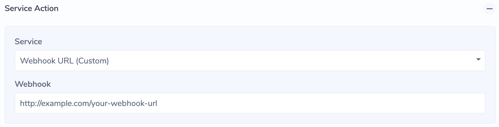

#### 11.2.1 Request Payload

The following request data is sent via HTTP POST from the Converse Dialog Engine to the specified Web Service endpoint:

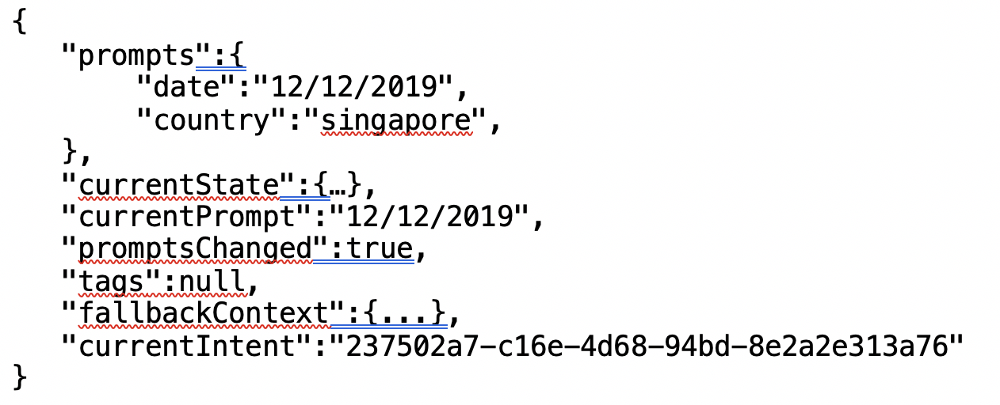

| **Key** | **Description** |
| :--- | :--- |
| prompts | Variables captured in the Context of the dialog sequence. Data collected from users will be stored here. |
| currentState | The current State that the Dialog Engine is currently on |
| currentPrompt | Current user utterance |
| promptsChanged | Flag to identify change in prompts |
| tags | The tags of all the intents triggered during the course of conversation. |
| fallbackContext | Information regarding the fallback |
| currentIntent | The ID of the current Intent |

### 

#### 11.2.2 Response Payload

Converse expects the response data from the Web Service to be of the following JSON structure. All properties are optional.

 {

 "message": "this is a message"

 “data": {…},

 "links": \[…\],

 }

### 

**11.2.2.1 message**

If a **message** property is specified, it will be output as the Bot message.

{

 "message": "this is a message"

}

| **Key** | **Description** |
| :--- | :--- |
| message | The text to display as a reply |

Example:

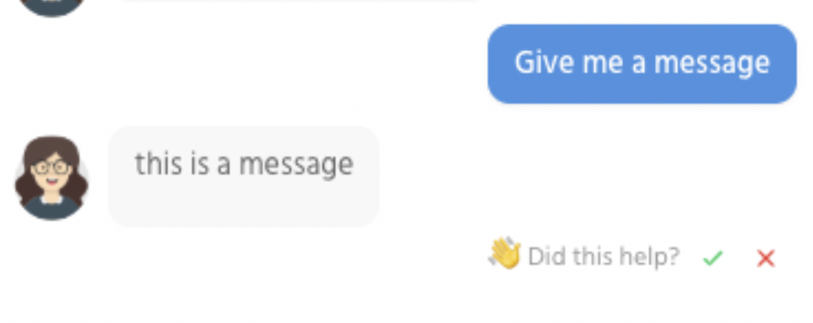

**11.2.2.2 links**

The links may contain a list of intent IDs and labels which is will output on the Chat UI as clickable buttons. Users will be able to trigger the respective intent when they click on the button.

{

 "links": \[

 {

 "enquiry": "2d2dd0ff-8870-4401-4444-8374d7aafe04",

 "text": "Things to do in China"

 },

 {

 "enquiry": "2d2dd444-8870-4401-b76c-8374d7aafe04",

 "text": "Things to do in India"

 }

 \]

}

| **Key** | **Description** |
| :--- | :--- |
| enquiry | The Intent ID to be triggered |
| text | The text to display on the button for the respective enquiry |

For the data above, the UI will display the following:

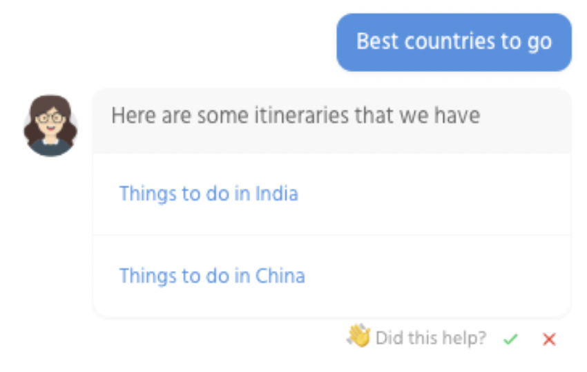

**11.2.2.3 data**

The data object should contain key-value pairs. The key of each variable will be used as the variable’s name, which can be referenced inside a State’s Content field \(see screenshot below\).

Given the following data:

{

 "data": {

 "country": "Singapore",

 "date": "19/01/2020",

 "locationTemperature": 26,

 }

}

And the following template in the State’s Context field:

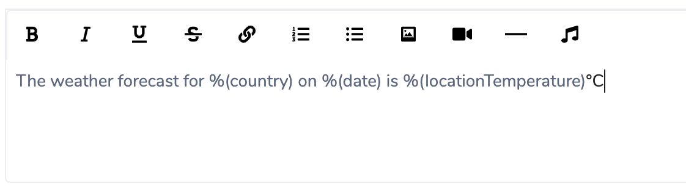

When the State is triggered, then bot will respond with the following message:

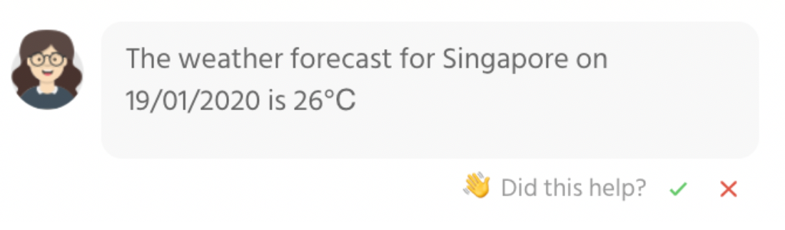

## 

## 12 User & Roles Management \(for Super Admins\)

User and Role management are done on the KPO Platform, which Converse sits on.

Please note: You need to have the Super Admin role to access these functionalities.

To access the settings for User & Roles Management:

1. Log in onto the KPO platform.
2. Click on the  icon on the navigation bar. You will be directed to the Organisation Management page for your organisation.

### 12.1 Creating User

1. Click on the button. A pop-up window will be displayed asking for the new user’s details such as Name, Username, Email, Password & Organisation.

1. Complete the form and click on  to create the new user.

### 12.2 View User

On the organisation management page, click on the user you want to view. The information of the user profile will be displayed in 2 panels:

1. User Information Panel - For editing user information and/ro deleting user
2. Product Role Settings - For assigning products / setting roles for users

**Edit User**

Click on the  button to edit. A panel will be displayed with two options:

1. Edit Personal Info. Select this option to edit the first and last name. A pop-up will appear with the user’s existing first and last name as editable input fields.

1. Change Password. Select this option to edit the password. A pop-up will appear prompting for the new password and new password confirmation.

**Delete User**

1. Click on the button to delete the user.
2. A pop-up will appear prompting for confirmation. Click to delete the user.

### 12.3 Assigning Converse & Setting Roles to a User

To assign Converse to a user, you will first need to set the user a role. 3 possible roles can be assigned to users:

* Super Admin
* Admin
* User

The breakdown of the roles and access rights will be covered in more detail in the next section.

1. For the selected user, navigate to the product role settings panel and search for CONVERSE.
2. Expand the dropdown for the CONVERSE product. All the 3 possible roles will appear as options.
3. Select the desired role to be assigned for the selected user. Once the assignment is successful, the following notification will be displayed.

### 12.4 Roles and Access Rights

<table>
  <thead>
    <tr>
      <th style="text-align:left"></th>
      <th style="text-align:left"><b>Super Admin</b>
      </th>
      <th style="text-align:left"><b>Admin</b>
      </th>
      <th style="text-align:left"><b>User</b>
      </th>
    </tr>
  </thead>
  <tbody>
    <tr>
      <td style="text-align:left">
        
User Management

        <ul>
          <li>Create User</li>
          <li>Edit User</li>
          <li>Delete User</li>
        </ul>
      </td>
      <td style="text-align:left">Full Access</td>
      <td style="text-align:left">No Access</td>
      <td style="text-align:left">No Access</td>
    </tr>
    <tr>
      <td style="text-align:left">
        
Account Settings

        <ul>
          <li>Set Username</li>
          <li>Set Password</li>
        </ul>
      </td>
      <td style="text-align:left">Full Access</td>
      <td style="text-align:left">Full Access</td>
      <td style="text-align:left">Full Access</td>
    </tr>
    <tr>
      <td style="text-align:left"><b>Build Content for a Bot</b>
      </td>
      <td style="text-align:left"></td>
      <td style="text-align:left"></td>
      <td style="text-align:left"></td>
    </tr>
    <tr>
      <td style="text-align:left">View Intents, Phrases, Libraries</td>
      <td style="text-align:left">Full Access for All Bots</td>
      <td style="text-align:left">Yes, if have View Permission on Bot</td>
      <td style="text-align:left"></td>
    </tr>
    <tr>
      <td style="text-align:left">Create/Edit/Delete Intents, Phrases, Libraries for a Bot</td>
      <td style="text-align:left">Full Access for All Bots</td>
      <td style="text-align:left">Yes, if have Edit Permission on Bot</td>
      <td style="text-align:left"></td>
    </tr>
    <tr>
      <td style="text-align:left">Train NLU</td>
      <td style="text-align:left">Full Access for All Bots</td>
      <td style="text-align:left">Full Access</td>
      <td style="text-align:left">No Access</td>
    </tr>
    <tr>
      <td style="text-align:left">Test All / Test Phrases</td>
      <td style="text-align:left">Full Access for All Bots</td>
      <td style="text-align:left">Full Access</td>
      <td style="text-align:left">Full Access</td>
    </tr>
    <tr>
      <td style="text-align:left"><b>Bot Configuration</b>
      </td>
      <td style="text-align:left"></td>
      <td style="text-align:left"></td>
      <td style="text-align:left"></td>
    </tr>
    <tr>
      <td style="text-align:left">Edit Bot Name</td>
      <td style="text-align:left">Full Access for All Bots</td>
      <td style="text-align:left">Yes, if have Edit Permission on Bot</td>
      <td style="text-align:left"></td>
    </tr>
    <tr>
      <td style="text-align:left">Manage Bot Libraries</td>
      <td style="text-align:left">Full Access for All Bots</td>
      <td style="text-align:left">Yes if have Edit permissions on Bot</td>
      <td style="text-align:left"></td>
    </tr>
    <tr>
      <td style="text-align:left">Manage Bot Administrators and Permissions</td>
      <td style="text-align:left">Full Access for All Bots</td>
      <td style="text-align:left">Yes if have Owner permissions on Bot</td>
      <td style="text-align:left"></td>
    </tr>
    <tr>
      <td style="text-align:left">
        
Advanced Bot Configurations

        <ul>
          <li>Set Default Bot Config</li>
          <li>Default CSS</li>
          <li>Default Widget CSS</li>
          <li>Avatar</li>
          <li>Landing Page</li>
          <li>Asset Library</li>
        </ul>
      </td>
      <td style="text-align:left">Full Access for All Bots</td>
      <td style="text-align:left">Yes, if have Edit Permission on Bot</td>
      <td style="text-align:left">Yes, if have Edit Permission on Bot</td>
    </tr>
    <tr>
      <td style="text-align:left"><b>Manage Unhandled Phrase for a Bot</b>
      </td>
      <td style="text-align:left"></td>
      <td style="text-align:left"></td>
      <td style="text-align:left"></td>
    </tr>
    <tr>
      <td style="text-align:left">View Unhandled Phrases</td>
      <td style="text-align:left">Full Access for All Bots</td>
      <td style="text-align:left">Yes, if have View Permission on Bot</td>
      <td style="text-align:left"></td>
    </tr>
    <tr>
      <td style="text-align:left">Resolve / Mark Invalid / Revert</td>
      <td style="text-align:left">Full Access for All Bots</td>
      <td style="text-align:left">Yes, if have Edit Permission on Bot</td>
      <td style="text-align:left"></td>
    </tr>
    <tr>
      <td style="text-align:left">Group Similar Phrases</td>
      <td style="text-align:left">Full Access for All Bots</td>
      <td style="text-align:left">
        
Full Access

        
Must have at least View permission for the Bot

      </td>
      <td style="text-align:left">No Access</td>
    </tr>
    <tr>
      <td style="text-align:left"><b>Ontology Management</b>
      </td>
      <td style="text-align:left"></td>
      <td style="text-align:left"></td>
      <td style="text-align:left"></td>
    </tr>
    <tr>
      <td style="text-align:left">View Ontology</td>
      <td style="text-align:left">Full Access for All Bots</td>
      <td style="text-align:left">Yes, if have View Permission on Bot</td>
      <td style="text-align:left"></td>
    </tr>
    <tr>
      <td style="text-align:left">
        
Manage Ontology Data

        <ul>
          <li>Clear Ontology</li>
          <li>Load Ontology</li>
          <li>Clear Ontology Index</li>
          <li>Build Ontology Index</li>
          <li>Export Ontology</li>
          <li>Import Ontology</li>
        </ul>
      </td>
      <td style="text-align:left">Full Access for All Bots</td>
      <td style="text-align:left">
        
Partial Access

        
&quot;Clear Ontology&quot; is not available.

      </td>
      <td style="text-align:left">No Access</td>
    </tr>
    <tr>
      <td style="text-align:left">Train Ontology</td>
      <td style="text-align:left">Full Access for All Bots</td>
      <td style="text-align:left">Yes, if have View Permission on Bot</td>
      <td style="text-align:left">No Access</td>
    </tr>
    <tr>
      <td style="text-align:left">Analytics (all functionality included)</td>
      <td style="text-align:left">Full Access for All Bots</td>
      <td style="text-align:left">Yes, if have View Permission on Bot</td>
      <td style="text-align:left">Yes, if have View Permission on Bot</td>
    </tr>
  </tbody>
</table>

