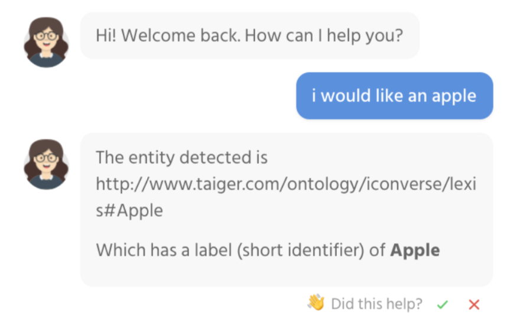
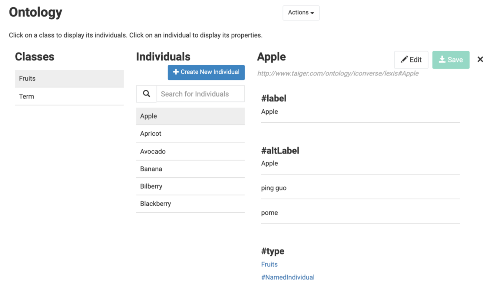
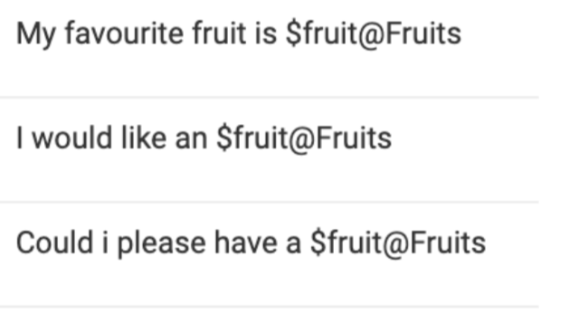
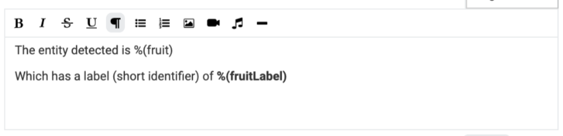
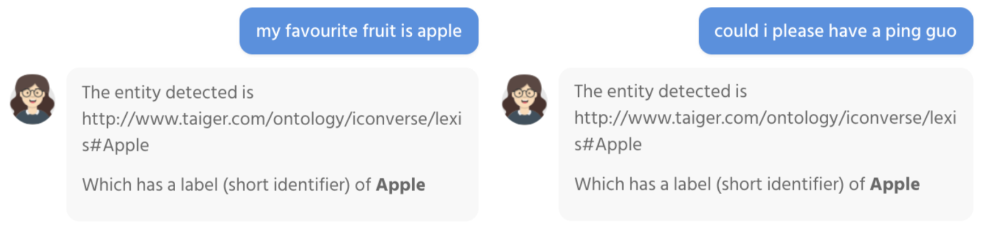

# Collect User Input using Variable Capture \(NER\)

## Introduction

We can extract an entity from user utterance, and add it into the [Conversation Context](../essentials/intent-and-dialog-building/conversation-context.md) to be utilized in preceding States of the triggered Intent.

**Example**

The following screenshot shows an example of Variable Capture in action, where the entity on the user utterance was extracted, and printed in the response to the user message.

## **Set Up Variable Capture**

### **Ensure that the Class exists in the Ontology**

Click on the Ontology tab on the navigation bar to access the Ontology Manager.

Note that only defined ontology elements can be extracted. Taiger or it’s certified partners’ knowledge engineers will build the Ontology, based on the domain of the FAQ data set.

A Class is a generalized grouping of Entities \(e.g. “Fruit”\) An Individual is a child of a Class \(e.g. “Apple”\)

Since we have the “Fruits” Class in the Ontology, we can set up Variable Capture to recognize and extract Fruit entities from user utterances.

### **Configure Intent’s Phrases**

Create an Intent if you have not already done so.

Navigate to the **Intent Dashboard &gt; Teaching** to view the phrases for each Intent.

In the teaching tool, we can specify several variations of how we expect the users to ask questions. We also specify the location where the entity is expected.

Variable Capture syntax is as follows:

**`$variableName@ClassName`**

Add the following Phrases:

### **Use the captured entity in the Intent's Response**

Navigate to the Intent Editor for the Intent you created, the edit first State's Content:

You can use the captured entity with the syntax **`%(variableName)`.** The variable name was specified in Step 2.

#### Using the Label of the Entity

The Entity captured is by default, an element in the Ontology, which has a Unique Identifier \(URI\). This identifier allows us to reference the exact ontology element, if needed.

Typically, what we would want to use in responses to the chat user is the short name \(a.k.a Label\) of the Ontology element.

To use the Ontology element’s Label, you should append the text "Label" to the variable name, i.e. **`%(variableNameLabel)`**

**You're all done! Check that your Bot responds in the following ways:**

