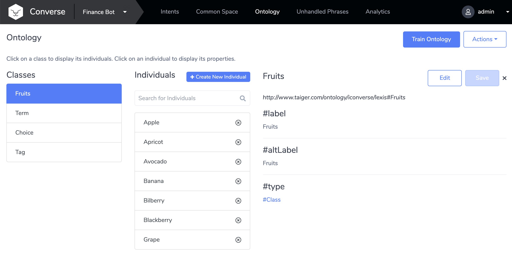
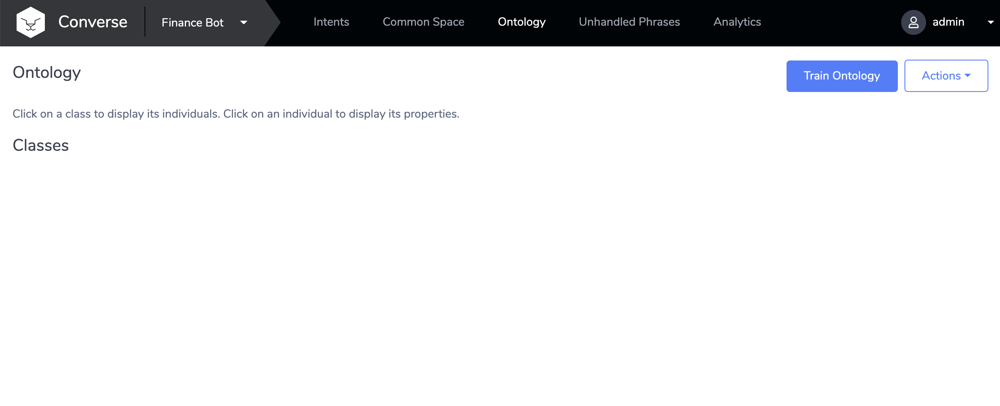
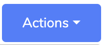
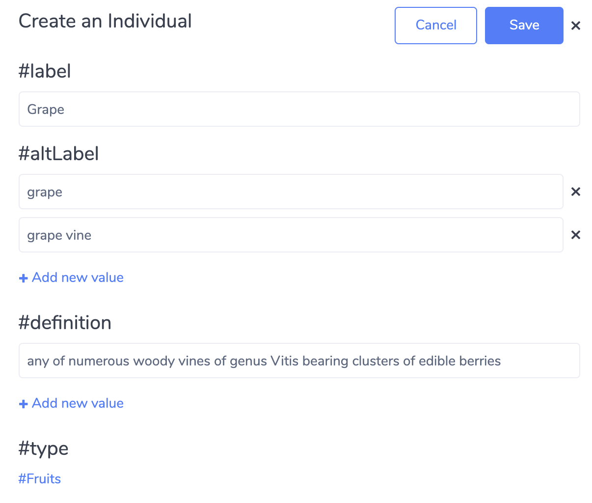
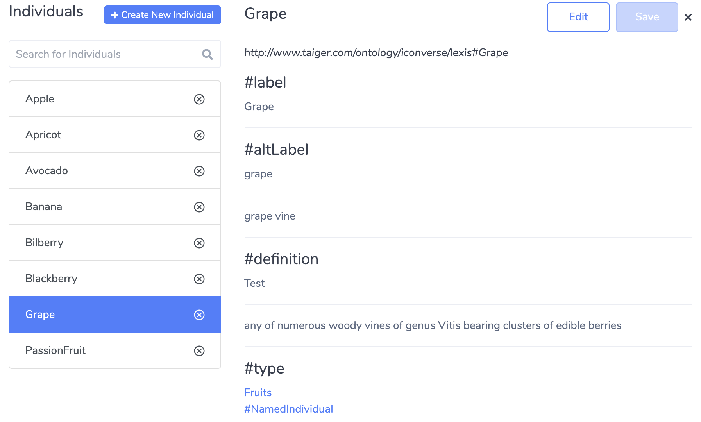
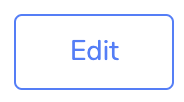
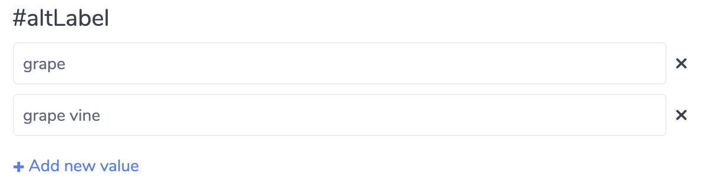

# Ontology Management

## View Ontology

To view the Ontology for the Current Active Bot, click on the **Ontology** link in the navigation bar.

Click on one of the displayed Classes to view the Individuals within them.

The Ontology view will be loaded as such:

**Note:** if you do not see a list of Classes, you may need to Load Ontology \(see [10.2 Load Ontology]()\)

## Load Ontology

When the Bot is newly created, no Ontology will be present yet, and the page will be empty.

To load up the default Ontology:

1. Click on the 'Actions' button on the top-right corner of the page
2. Click on "Load Ontology"
3. Within a few seconds, the Default list of Classes will appear

## Creating New Individual

Classes contain child Ontology elements, called "Individuals"

You can create a new Individual for a Class by:

1. Click on one of the Classes in the list
2. Click on the "+ Create New Individual" button
3. In the "Create an Individual pane" that opens, specify

* **\#label \(required\)**: The unique identifier of the Ontology element
* **\#altLabel \(optional\)**: A list of synonyms or related words to describe this Ontology Element. You can add more than one by clicking on "+ Add new Value"
* **\#definition \(optional\)**: Detailed descriptions of this Ontology element

Now click Click "Save"

The new Individual is created, and displayed in the list of Individuals as seen below:

## Editing Individual and Property Values

To edit the Individual:

* Click on the Edit button to access the Editor

* To remove a Property Value, click on the 'X' button on the right-side of the value
* To add a new Property Value, click the "+ Add new value" button under the list of Property Values
* Click "Save" to update the Individual

## Deleting Individuals

To delete an Individual, click on the 'X' icon on the Individuals listing

Please take care while doing this as it cannot be undone.

## Export Ontology

To export the Ontology for the Current Bot click on the "Actions" button on the top-right of the screen, and select Export Ontology.

* A **.ttl** file will be downloaded
* Save this file as a backup of your Ontology
* You can also Import this Ontology into another Bot by using the Import Ontology function in the next section.

## Import Ontology

To export the Ontology for the Current Bot click on the "Actions" button on the top-right of the screen, and select Import Ontology.

* In the file picker, select the **.ttl** file
  * Note: the .ttl file should have been previously exported via the Export Ontology function
* The Bot's Ontology should now be loaded with the new Ontology elements

## Train Ontology

After Adding or Removing Individuals from the Ontology, you'll need to Train Ontology so that the Converse AI Engine can pick up changes made.

After running "Train Ontology", you'll still need to execute "Train Bot" in the Intent Dashboard so that the AI Engine can also process the Intents and Phrases.

**Tip:** You can also skip "Train Ontology" and proceed directly to "Train Bot", since "Train Bot" also checks for changes to the Ontology automatically.

