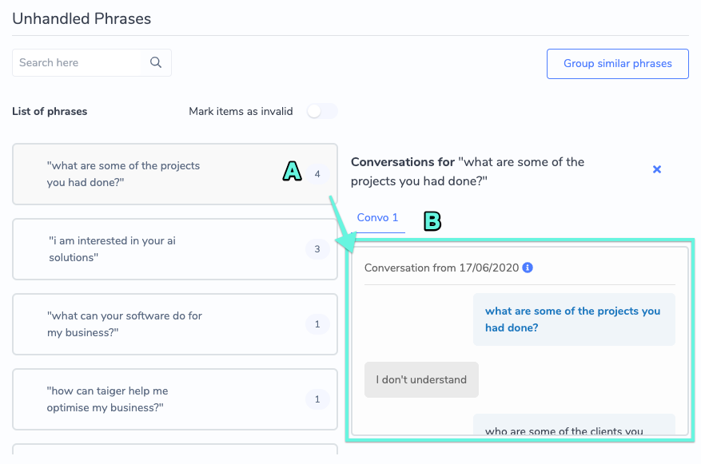
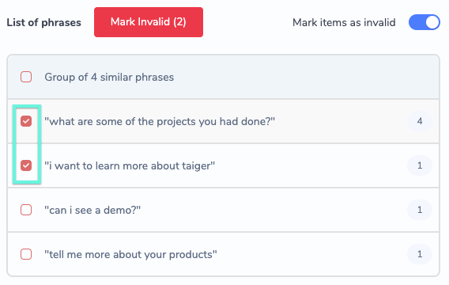
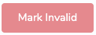
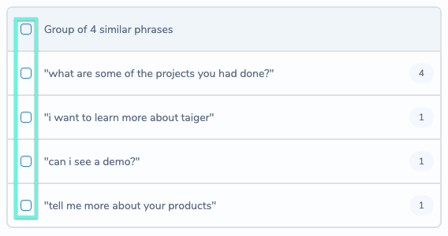
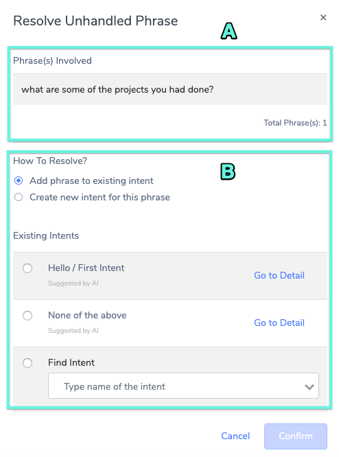

# Improving Your Bot with Unhandled Phrases

## Introduction

Managing unhandled phrases allows you to quickly view common phrases asked by the users that the VA could not confidently answer. It allows you to manage previous conversation data to resolve these unhandled phrases by either creating new intent or assigning the phrases to an existing intent.

In addition, you can group these phrases that are similar so it can be processed as a batch. These phrases are sorted by the system based on the total frequency of occurrences.

You can mark a phrase as invalid for those out of scope or spam user inputs. Furthermore, you can undo or revert invalid phrases back to unhandled for further verification.

In the Unhandled Phrases Manager, phrases are categorised into three categories:

1. Unhandled – Phrases that the bot was unable to handle
2. Resolved – Previously unhandled phrases that has been assigned to an intent
3. Invalid – Previously unhandled phrases deemed to be invalid

The manager also displays the number of times each category of phrases appeared in conversations.

There are 2 main steps to process unhandled phrases.

1. Identifying and “marking” invalid Unhandled Phrases
2. Identifying valid Unhanded Phrases and resolving them

## Step 1: Mark Invalid Unhandled Phrases

To begin processing unhandled phrases, it is important to first identify and “mark” and invalid phrases. Phrases are considered Invalid if any of the following is being identified:

* Phrase is a single term OR could mean many things \(vague phrasing leads to errors and lower accuracy\). For example, “want to go”, the bot responds “that’s kind of vague…can you please rephrase?”.
* There is a spelling error in the phrase. Do not teach the system with broken spelling, unless it is a common spelling error.
* There is more than one intention in the phrase \(Multiple intents = vague!\).
* It is not phrased as a question. For example, feedback from the user.

### Marking Phrases as Invalid

1. Navigate to the Unhandled Phrases tab. A list of all unhandled phrases for the selected bot will be displayed.
2. For each phrase, you will be able to view each conversation log by selecting the phrase. The conversation log will allow you to review the context of conversation which led to the unhandled phrase.
3. You can also see the number of times each unhandled phrase appeared in conversations.

1. Click the button. Upon clicking, the system will attempt to group the unhandled phrases together based on their meaning.
2. Once the intents are grouped, toggle the  switch to **ON**. The checkboxes for the intents and their parent group will turn red.
3. Start “marking” invalid intents by checking the checkboxes. 
4. To confirm “marking”, click on the  button. A pop-up window will be displayed asking for confirmation. Select **Yes** to confirm “marking”.
5. Toggle the  switch to OFF.

### Viewing Invalid Phrases

To view invalid phrases, select the  phrases tab on the left hand panel of the unhandled phrases manager. All phrases marked as invalid will be displayed. For invalid phrases, you will be able to:

1. View each conversation log by selecting . The conversation log will allow you to review the context of conversation which led to the unhandled phrase.
2. Revert invalid phrases to become “unmarked”.

### Reverting Invalid Phrases

To revert previously resolved unhandled phrases:

1. Under the Actions column for the selected phrase, click the  button.
2. A pop-up window will appear asking for confirmation of reversion for the selected phrase.

## Step 2: Identify and Resolve Valid Unhandled Phrases

Now that you have removed the invalid phrases, the next step will be to teach the system to understand the remaining phrases by **Resolving** them.

### Selecting Phrases with the same Intents for Resolving

As multiple Unhandled Phrases can have the same meaning, they should be resolved to the same Intent.

1. Select the  phrases tab on the left hand panel of the unhandled phrases manager.
2. For each group of unhandled phrases, select the unhandled phrases with the same intent by checking the Blue Checkboxes of each phrase. You can also select all phrases at once by clicking on the first checkbox.
3. Repeat **Step 2** for each group of unhandled phrases.

### Resolving by Adding to Existing Intent

To resolve the selected unhandled phrases within each group, select the button on the top-right corner of the group. A pop-up window is displayed with the following sections:

1. Phrase\(s\) Involved – This section displays the list of phrases that you selected and want to resolve.
2. How to Resolve? – This section allows you to select the method you wish to resolve the selected unhandled phrases with.

The **Add phrase to existing intent** option will be selected by default. For this option, the system will suggest a list of existing intents segregated into 3 categories to choose from.

* Suggested by AI – This intent is suggested by the system \(AI engine\).
* Suggested both by User & AI – This intent is suggested by the system based on user feedback.
* Manually searching for a suitable intent.

For phrases with no suitable existing intent, you will need to _Resolve by Creating New Intent_ \(see next section\)

For each listed intent, you can view and edit the intent details by clicking .

**To resolve phrases with this method,**

1. Select one from the suggested intents or search for an intent by name. If there is no suitable existing intent, skip this step and click Create new intent for this phrase.
2. Click the  button. Once done, the resolved unhandled phrases will be moved to the Resolved section.

### Resolving by Creating New Intent

To resolve phrases with this method,

1. Select the **Create new intent for this phrase** option.
2. Add a name for the new intent.
3. Select a library.
4. Click the  button. Once done, the resolved phrase is immediately added to the newly created intent and taught to the bot. These phrases will then be moved to the Resolved section.

### Viewing Previously Resolved Phrases

To view previously resolved phrases, select the  tab on the left hand panel of the unhandled phrases manager. All resolved phrases will be displayed and you will be able to:

1. View each conversation log by selecting . The conversation log will allow you to review the context of conversation which led to the unhandled phrase.
2. Revert resolved phrases.

### Reverting Previously Resolved Phrases

To revert previously resolved unhandled phrases:

1. Under the Actions column for the selected phrase, click the  button.
2. A pop-up window will appear asking for confirmation of reversion for the selected phrase.

