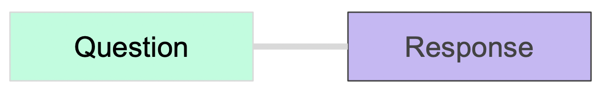
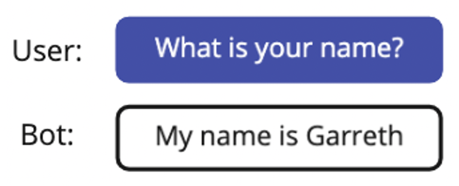
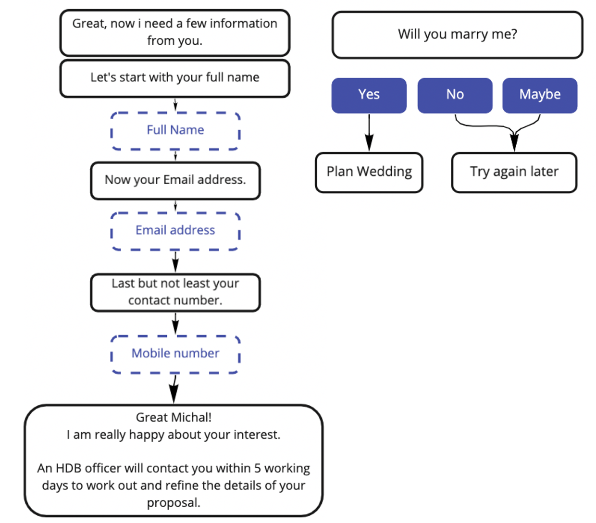

# Intent & Content Building

## Introduction to Intents

Intents refer to a Question and Response pair in Converse.

For a given Chat User query \(e.g. "Tell me about your products"\), the Converse Bot understands the user input using our proprietary Hybrid AI Intent Classifier, and _triggers_ the Intent that has the best response.

The Converse Bot is able to determine the right Intent to trigger if Intents have been configured with sufficient and diverse Phrases \(see [Teaching Your Bot](../teaching-your-bot.md) to learn more about the teaching tool\)

When an Intent is triggered, the Bot replies to the Chat User with the Response configured on the Intent

## Intent Response

* An Intent Response can have one or many steps that we call _States_
* In each Step, the Bot can act by sending a message to the user, or calling an external web service

<table>
  <thead>
    <tr>
      <th style="text-align:left"></th>
      <th style="text-align:left"></th>
    </tr>
  </thead>
  <tbody>
    <tr>
      <td style="text-align:left">
        
<b>One State - Direct Answer</b>
        

        
A Chat User&apos;s question can be fulfilled by a single reply.

        
This is commonly used for FAQ Bots.

      </td>
      <td style="text-align:left">
        
      </td>
    </tr>
    <tr>
      <td style="text-align:left">
        
<b>Multiple States - Guided Flow</b>
        

        
The response contains multiple steps.

        
This is required when the Bot needs more information from the Chat User
          before fulfilling the request.

        
This is typically used in more advanced Bots that can perform Transactions
          for Users.

      </td>
      <td style="text-align:left">
        
      </td>
    </tr>
  </tbody>
</table>

### 

