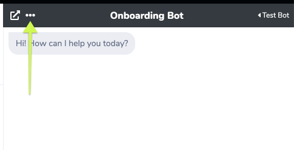
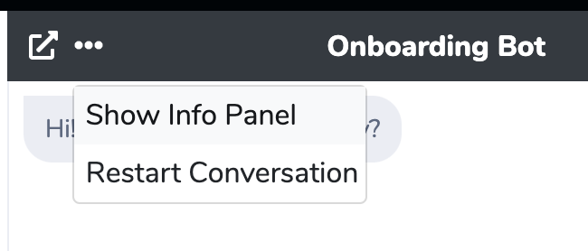
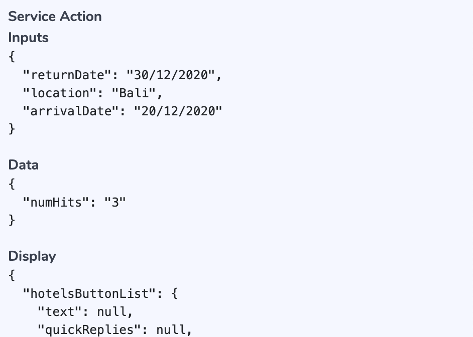
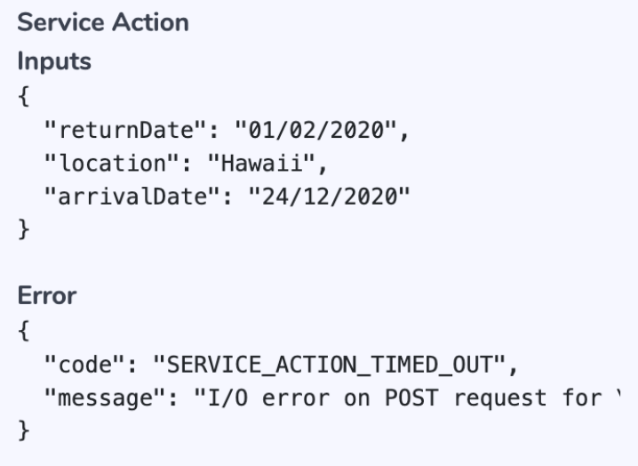

# Admin Chat Info Panel

When creating Guided Flows it is often useful to see the data stored in the [Conversation Context](conversation-context.md). To do so, you can use the **Admin Chat Info Panel** feature.

## **Toggle the Info Panel**

Click on the "..." menu button on the top-left of the Admin Chat header, and then click on the "Show Info Panel" item. You can use the same menu item to hide the Info Panel.

## **Usage Scenarios**

<table>
  <thead>
    <tr>
      <th style="text-align:left"><b>Scenario</b>
      </th>
      <th style="text-align:left"><b>Example</b>
      </th>
    </tr>
  </thead>
  <tbody>
    <tr>
      <td style="text-align:left">
        
<b>Inspect Data Collected from User</b>
        

        
In this scenario, the first State asks the Chat User &quot;What city would
          you like to go to?&quot;, and also has the Data Collection block activated
          to collect the user&apos;s reply in the <em><b>city</b></em> variable.

        
After the Chat User replies with &quot;Bali&quot;, this value is stored
          in the Conversation Context in the <em><b>city</b></em> variable

      </td>
      <td style="text-align:left">
        
      </td>
    </tr>
    <tr>
      <td style="text-align:left">
        
<b>Inspect</b>  <a href="editing-an-intent.md#service-action-block">Service Action</a><b> Inputs and Outputs</b>
        

        
When executing external services via Service Action, it is useful to see
          what is being sent to the Service as <em>Inputs</em> and what is being returned
          in the response as <em>Data</em> and or <em>Display</em>
        

      </td>
      <td style="text-align:left">
        
      </td>
    </tr>
    <tr>
      <td style="text-align:left">
        
<b>Inspect Service Action Errors</b>
        

        
As errors can occur in Service calls, Service Action provides error handling
          capabilities.

        
If an error occurred, you will see the Error Code and Message on the Info
          Panel.

      </td>
      <td style="text-align:left">
        
      </td>
    </tr>
  </tbody>
</table>

