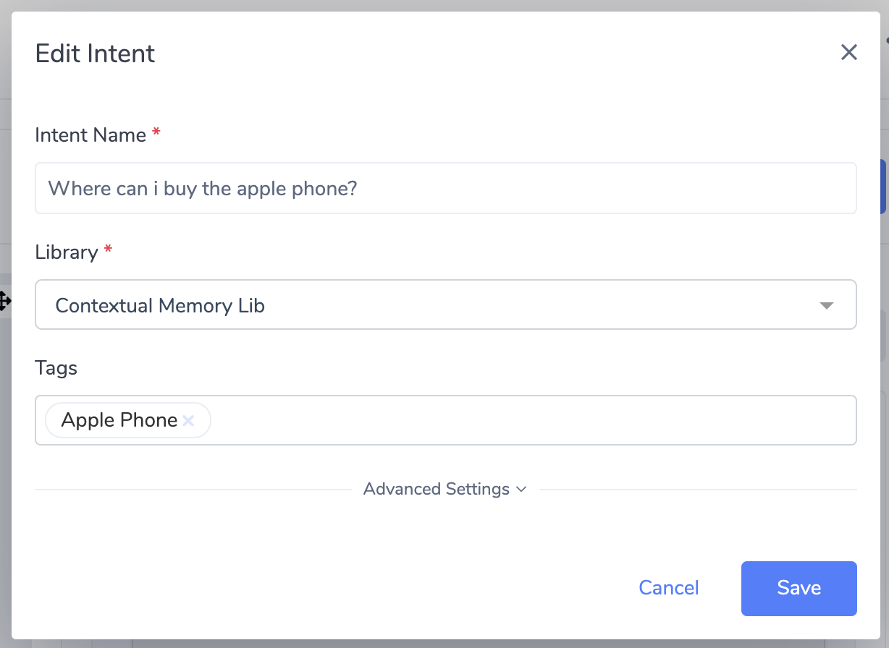
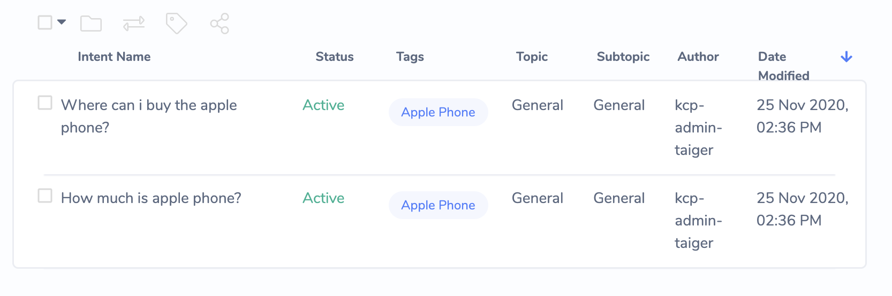
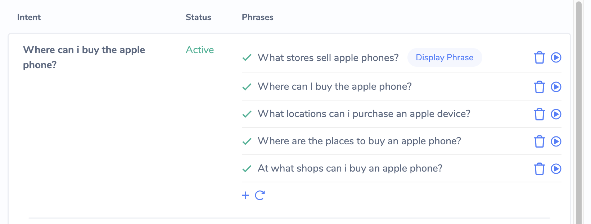
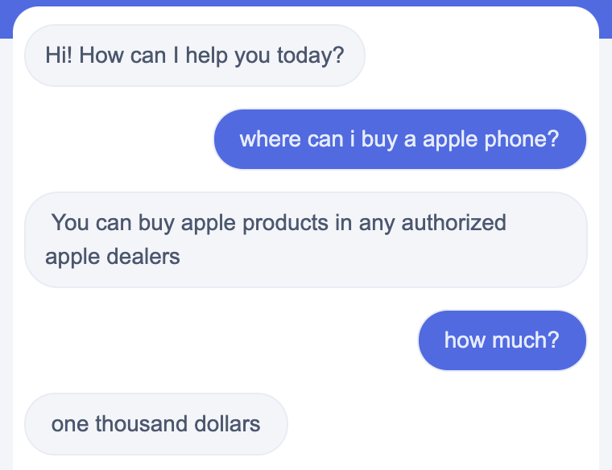

# Conversation Context

In simple terms, the Conversation Context can be seen as the "short term memory" of the chatbot when it is having a conversation with a Chat User.

## Usage Scenario: Replying based on Contextual Memory

Having this "Short Term Memory" is essential when engaging in conversation, because it allows the Bot to remember and use information previously provided by the Chat User.

1. Create Tag as the subject of the intended conversation and assigned it to the related intents

2. Teach the Bot with phrases containing the subject Tag created for the intents \(e.g. \#Apples are added as the Tag to the intent, and the phrases taught to it will contains the word apple.\) 

3. The Bot will now store the subject \(e.g. _Apple_\) in the context and will used it in providing appropriate answers without the need for Chat User to specific it in the query.  

## Usage Scenario: **Data Collection**

The Conversation Context is able to store data entered by the Chat User during the conversation.

In figure above, the Data Collected from the user is stored in the Conversation Context and then reiterated back to the Chat User. The Bot then uses the stored data to call an external API service to fulfill the customer's request.

Data Collected from the Chat User can be inserted into Message Components using the syntax **%\(answers.**&lt;variableName&gt;**\)**. For examples of how this is used, please refer to [Data Collection Block](editing-an-intent.md#data-collection-block)

## Usage Scenario: Transactional Flows with Service Action \(for Technical Users\)

The Conversation Context also stores data returned from External Services, called via [Service Action](editing-an-intent.md#service-action-block).

In this scenario:

* The data collected from the Chat User is retrieved from the Conversation Context and sent to the Converse Plugin \(via Service Action\)
* The Converse Plugin formats the data and sends it as a request to the Web Service
* The response data from the Web Service is transformed by the Converse Plugin, and then stored in the Conversation Context \(via Service Action\)
* The Data from the Web Service can then be retrieved from the Conversation Context to be displayed to the Chat User, or used within conditional logic inside Transitions.

For a detailed example of how Service Action is used to create such API-driven Transactional Flows, please see [Building Transactional Flows with Service Action](../../advanced/building-transactional-flows.md).

