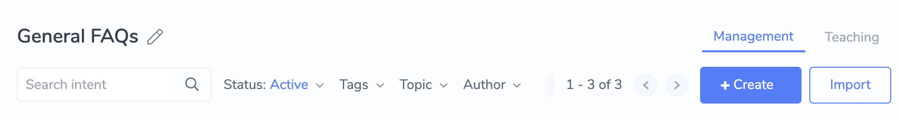
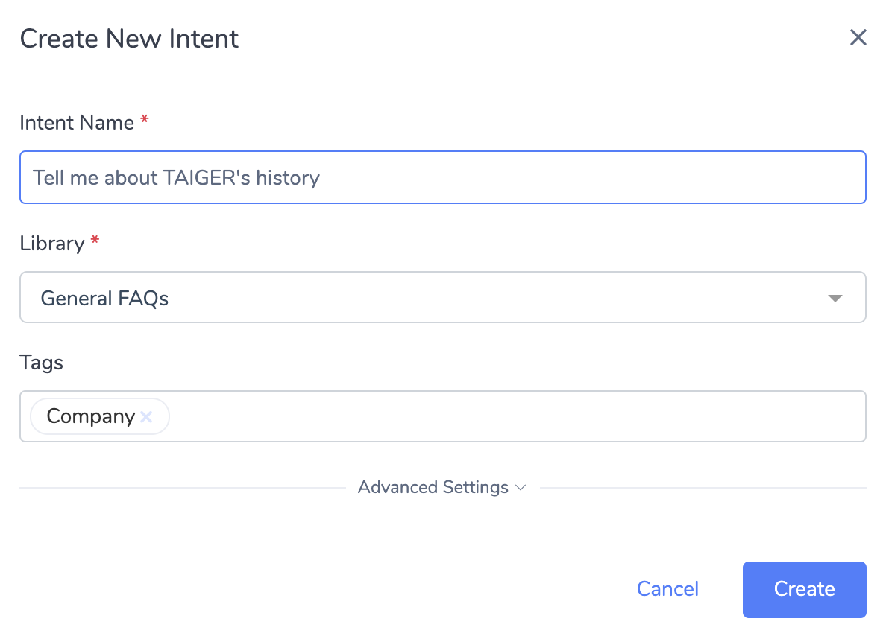
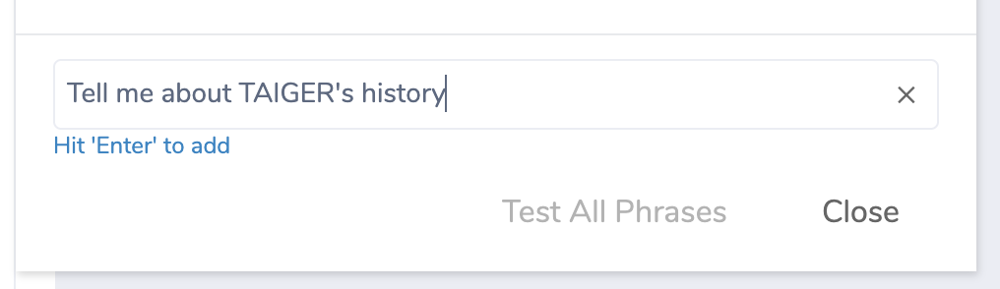
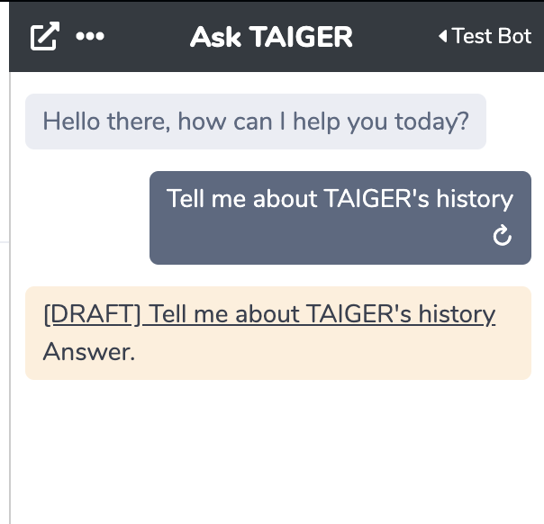
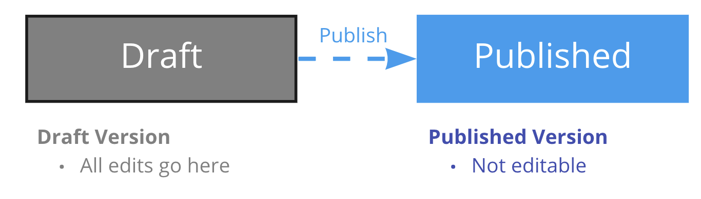

# Create an Intent

## Creating an Intent

1\) Start by clicking on the "+ Create" button on the Intent Dashboard &gt; Management View

2\) In the Popup that appears, enter in the following fields:

* **Intent Name:** Any memorable name will do. We recommend entering something Chat Users to say to trigger this Intent
* **Library:** This should be pre-filled based on the Library you are currently viewing in the Intent Dashboard
* **Tags \(optional\):** Tag with topic\(s\) so that you can search for it easier later

3\) Click "Create"

4\) If the intent is successfully created, you will be brought to the Intent Editor page for your new Intent.

The Phrases Panel will appear to prompt you to add a Phrase. For now, just enter the same as the Intent Name and hit the _Enter_ key to add the phrase.

After adding the Phrase, you can close the Phrase Panel.

Great, you've successfully created your first Intent!

## Quick-Test Intent Trigger in the Admin Chat UI

To force-trigger an Intent, you can click the Quick-Test  button at Intent Editor's top section, which will trigger the Intent in the Admin Chat UI as shown below:

This will trigger the Intent in the Admin Chat UI, as though a Chat User had asked a question and triggered this Intent.

### **Quick-Test Draft Version**

* If Quick-Test is used while the Intent Editor is in Edit Mode, then the Intent Response will be the DRAFT version of the Intent.
* When the Draft version is displayed, the text "\[DRAFT\]" appears before the Intent's name, and the Bot response message bubble is in a beige color.

### **Quick-Test Published Version**

* If the Intent is Activated and the Intent Editor is not in Edit Mode, using the Quick-Test function will trigger the PUBLISHED version of the Intent.
* When the Published version is displayed, the message bubble is the regular color and the Bot response message bubble is in a grey color.

## Content Authoring with Draft and Published versions

Each Intent in Converse can have 2 possible versions - DRAFT and PUBLISHED.

This allows Bot Admins to author content on the Intent's Response without directly affecting what is shown to the Chat Users. Once the content authoring on the Draft version is complete, the Bot Admin can Publish the Draft version, thereby replacing the Published version.

