# Editing an Intent

## Edit Intent Details

1. Click the Pencil  button at Intent Editor's top section, as shown below:
2. This will open the Intent Details Popup, which allows you to change the following Intent Properties:
   * Intent Name
   * Library \(this will move the Intent to the specified Library\)
   * Tags
   * Short Intent Name \(controls what is displayed on the Button Link, if this Intent is referenced as a Related Intent\)

## Making Content Edits while the Intent is Activated

To make content edits to an Activated Intent

* Click on the Edit button in the Intent Editor. This will enable the "Edit Mode"
* While In Edit Mode, changes are saved to a "Draft" version, and not immediately visible on the Public Chat UI. However, you can still test your changes using the _Quick-Test_ function.
* Once you are done with the changes, you can Publish them by clicking on the "Publish" button on the top-right side of the "Edit Mode" interface

Note: While the Intent is INACTIVE, Edit Mode enabled by default, so you are always editing the "Draft" version of the Intent.

Learn more about Intent Statuses [here](change-an-intents-status.md).

## Configuring an Intent's Response using the State Editor

* An Intent Response can have one or many steps that we call _States_
* In each State, the Bot can act by sending a message to the user, and / or calling an external web service

### **View Only and Edit Mode**

If the Intent is ACTIVE, the State Editor will initially be in View Only mode, and the content for the PUBLISHED version is displayed. Click on the "Edit" button \(see image below\) to begin editing the DRAFT version.

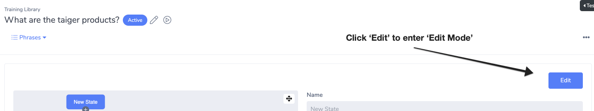

If the Intent is INACTIVE, the State Editor will automatically be in Edit Mode and you can begin editing the DRAFT version immediately.

### **State Editor Components**

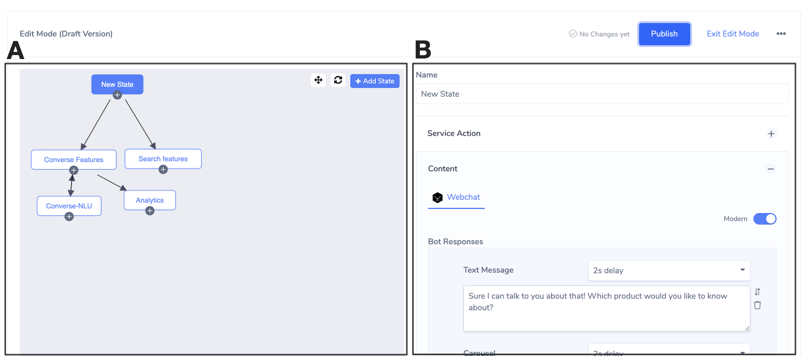

**A\) Flow Diagram**

An Intent's States can be connected together into a Dialog _Flow,_ to give a multi-step response.

The Flow Diagram provides a visual representation of the Dialog Flow's structure. This is very useful especially for complex dialog flow structures with many States and pathways.

**Select a State for Editing**

The State Editor allows you to edit the States of the Dialog Flow. One State can be edited at any given time. Click on the Box / Node on the Flow Diagram to select the State.

The Selected State is filled in Blue like so: 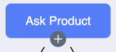

**Create a new State**

There are several ways to create a new State:

* Click on the circular "+" icon found below on every State's node on the Flow Diagram
* Click on the "+ Add State" button on the top-right hand corner of the Flow Diagram canvas.
* Create a new State while configuring a Message Component in the Content Editor

**B\) State Configuration Panel**

This panel displays the configuration options for the currently Selected State. Each of the available options are described in the next section.

### State Configuration Panel

#### **Name**

The State's Name is displayed on the State's Node on the Flow Diagram. It is best practice to give a meaningful name to describe the content or purpose of that State.

#### **State Blocks**

The State Configuration Panel contains State Blocks, each providing specific functionality when added to the State by clicking on the "+" button on the top-right hand side of each Block. Likewise, you can remove that functionality from the State by clicking on the "-" button.

#### Order of execution for State Block functionality

The functionality of each Block is executed in the same order as it is displayed on the UI. For example, the Service Action Block is executed before the Content Block. This means that data returned from the Service Action is accessible in the Content Block of the same State.

#### **Service Action Block**

Using Service Action, you can create conversation flows that pull/push data from your database and backend systems. Conversation Data is stored in the [Conversation Context](conversation-context.md), which can be used to drive conversation logic.

Service Action allows you to call Converse Middleware Services or a Custom Webhook. See [Data Integrations](../../advanced/data-integrations.md) for a deep-dive into creating Converse Plugins or a Webhook.

**1\) Service**

Displays a list of available Services installed on the Converse Middleware. If "Webhook URL \(Custom\)" is selected, then the system expects a data payload that follows the specification found in [Configuring a Webhook Connector](../../advanced/data-integrations.md#configuring-a-webhook-connector).

**2\) Function**

Displays a list of Functions available on the selected Converse Plugin.

**3\) Reference ID**

Allows BotAdmins to define a unique identifying name for this Service call. This name will be used to reference this Service call so that information can be obtained about it, such as the data response from the external service called.

**4\) Inputs**

After selecting the Function, each Input parameter required for this Function to run will be displayed as an input field. You can fill the Input Parameter using Context Variable or a hardcoded Text Value.

<table>
  <thead>
    <tr>
      <th style="text-align:left">Here are some usage examples:</th>
      <th style="text-align:left"></th>
    </tr>
  </thead>
  <tbody>
    <tr>
      <td style="text-align:left">
        
<b>Using Context Variable as inputs</b>
        

        
If you collected user input via the <a href="editing-an-intent.md#data-collection-block">Data Collection block</a> OR
          retrieved data via other Service Actions, then you can set the Input Type
          to &quot;Context&quot; to utilize data stored in the Context.

      </td>
      <td style="text-align:left">
        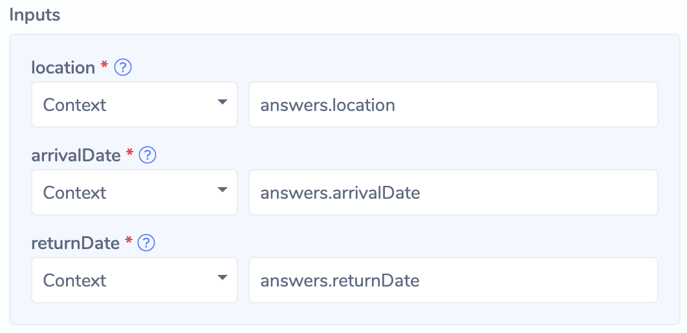
      </td>
    </tr>
    <tr>
      <td style="text-align:left">
        
<b>Using Text Value as inputs</b>
        

        
If you want to use raw text as Input, you can set the Input Type to &quot;Text
          Value&quot;.

      </td>
      <td style="text-align:left">
        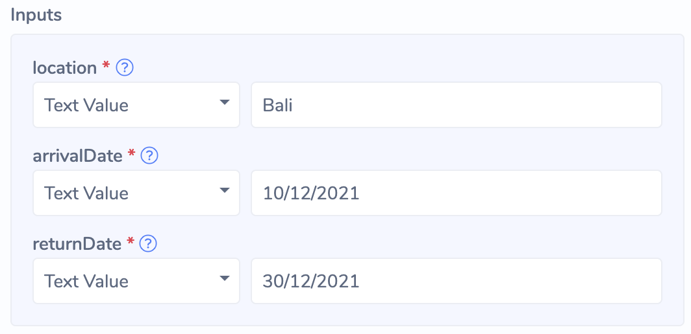
      </td>
    </tr>
  </tbody>
</table>

**5\) Outputs**

The Outputs specify the data that the Function can return after it is executed successfully. This is defined by the development team who built the Middleware Service.

<table>
  <thead>
    <tr>
      <th style="text-align:left">There are 2 types of Outputs:</th>
      <th style="text-align:left"></th>
    </tr>
  </thead>
  <tbody>
    <tr>
      <td style="text-align:left">
        
<b>Data Outputs</b>
        

        
Referenced later using:

        
&lt;referenceID&gt;.<b>data</b>.numHits

      </td>
      <td style="text-align:left">
        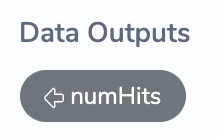
      </td>
    </tr>
    <tr>
      <td style="text-align:left">
        
<b>Display Outputs</b>
        

        
Referenced in Dynamic Component using:

        
&lt;referenceID&gt;.<b>display</b>.hotelsCarousel

        
&lt;referenceID&gt;.<b>display</b>.hotelsButtonList

      </td>
      <td style="text-align:left">
        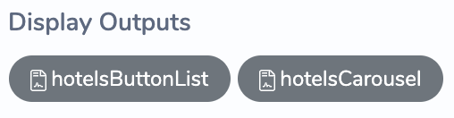
      </td>
    </tr>
  </tbody>
</table>

#### **Service Action Timeout**

Service Action will wait up to 5 seconds before timing out. If you wish to configure the timeout value, please contact your administrator.

#### **Detecting a successful call and handling errors**

Depending on success or failure of a Service call, Bot Admins will want their chatbot to send appropriate messages. The dialog structure is as follows:

#### **Detecting Errors**

If the Converse Plugin Function throws an error, Converse is notified via a reserved _**error**_ object on the Service Action response. The following properties are available in the _**error**_ object

| **Usage** | **Example** |
| :--- | :--- |
| &lt;referenceID&gt;.**error**.**code** | SERVICE\_ACTION\_TIMED\_OUT |
| &lt;referenceID&gt;.**error**.**message** | The Web Service took too long to respond |

Note that an Error's _**code**_ and _**message**_ can be configured by the Plugin's developer.

As such, we can set up Transition Conditions as follows so that the Dialog Engine reacts to the response success/error data from the Service Action.

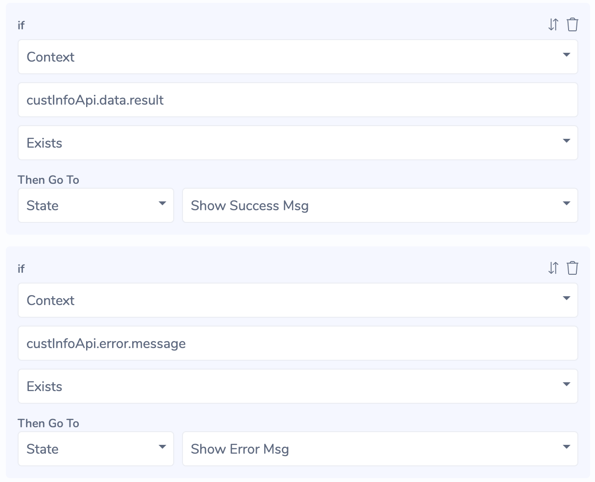

#### **Content Block**

The Content block allows you to configure what your Bot says to the user.

We provide 2 Editors:

* **Legacy Editor:**
  * Supports HTML formatting \(bold, italics, etc\)
  * Not compatible with upcoming chat channels like Facebook Messenger
  * Does not support new features like Carousel and Button List
* **Modern Editor:**
  * Supports all new Message Components
  * Immediately compatible with Facebook Messenger
  * Does not support HTML formatting

We highly recommend using the Modern Editor \(enabled with a switch on the right side of the Content block\)

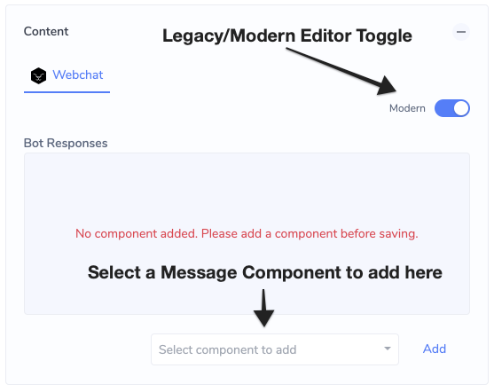

#### **Modern Editor - Message Components**

The Modern Editor allows you to compose Bot Responses using Message Components.

We currently support the following components:

<table>
  <thead>
    <tr>
      <th style="text-align:left"><b>Message Component</b>
      </th>
      <th style="text-align:left"><b>Example</b>
      </th>
    </tr>
  </thead>
  <tbody>
    <tr>
      <td style="text-align:left"><b>Text Message</b>
      </td>
      <td style="text-align:left">&lt;b&gt;&lt;/b&gt;
        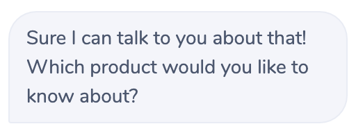
      </td>
    </tr>
    <tr>
      <td style="text-align:left"><b>Image</b>
      </td>
      <td style="text-align:left">
        
      </td>
    </tr>
    <tr>
      <td style="text-align:left">
        
<b>Quick Replies</b>
        

        
Supports:

        <ul>
          <li>A Text Message</li>
          <li>Up to 13 Quick Reply buttons</li>
          <li>Button Name must be less than 20 characters</li>
        </ul>
      </td>
      <td style="text-align:left">
        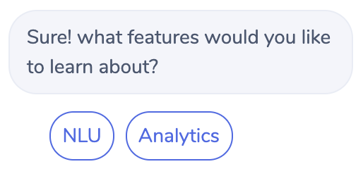
      </td>
    </tr>
    <tr>
      <td style="text-align:left">
        
<b>Button List</b>
        

        
Supports:

        <ul>
          <li>A Text Message</li>
          <li>Up to 5 buttons</li>
          <li>Button Name must be less than 20 characters</li>
        </ul>
      </td>
      <td style="text-align:left">
        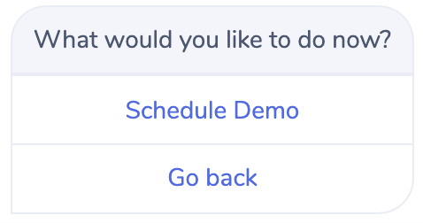
      </td>
    </tr>
    <tr>
      <td style="text-align:left">
        
<b>Card</b>
        

        
Supports:

        <ul>
          <li>An Image</li>
          <li>A Title</li>
          <li>A Description</li>
          <li>Up to 5 buttons</li>
          <li>Button Name must be less than 20 characters</li>
        </ul>
      </td>
      <td style="text-align:left">
        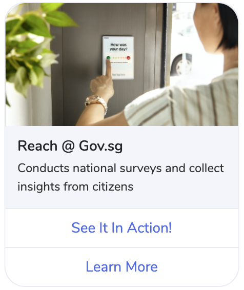
      </td>
    </tr>
    <tr>
      <td style="text-align:left">
        
<b>Carousel</b>
        

        
A Carousel is a series of Card components.

        
Minimum number of cards: 1

        
Maximum number of cards 10

      </td>
      <td style="text-align:left">
        
      </td>
    </tr>
    <tr>
      <td style="text-align:left">
        
<b>Dynamic Component</b>
        

        
Dynamic Component allows us to display dynamically generated Message Components
          returned by Service Actions

      </td>
      <td style="text-align:left">For an example of how Service Actions and Dynamic Components are used
        together, please see <a href="../../advanced/building-transactional-flows.md">Building Transactional Flows</a>.</td>
    </tr>
  </tbody>
</table>

#### **Button & Quick Reply Configuration Options**

Buttons and Quick Replies provide prompts to the Chat User. Users can click on them to advance through the conversation.

#### Button Types

The Button Type allows Bot Admins to configure what clicking on the Button/QuickReply does.

| **Type** | **Description** |
| :--- | :--- |
| Trigger State | Advances the conversation to the specified State within the same Intent's Flow |
| Trigger Intent | Brings the Chat User to the specified Intent's Flow |
| Send Postback | Sends text on behalf of the Chat User to the dialog engine. By default, the text sent is the same as the Button Name. Bot Admins can configure a custom text value that is different from the Button Name. |
| Open URL | Opens a specified Web URL in a new browser window or tab. |
| Open Webview | Opens a specified Web URL in a Webview, which is an overlay on top of the Chat Interface. |

#### Button Concept

Set an _Ontology Concept_ on the Button to allow it to be triggered by Text Input. If a new Ontology Concept is created, the _Synonym Editor_ will pop up. Bot Admins can define Synonyms of the Concept, which help the Bot match user inputs to the Ontology Concept.

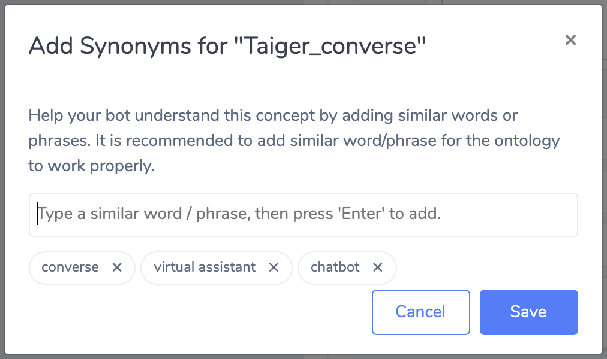

When a Chat User sends an input that matches any Synonym of the Button's Ontology Concept, the Button is triggered as though it was clicked.

If you want to change the synonyms, you can open the Synonym Editor again by clicking on the selected Concept Tag in the text input field \(see below\)

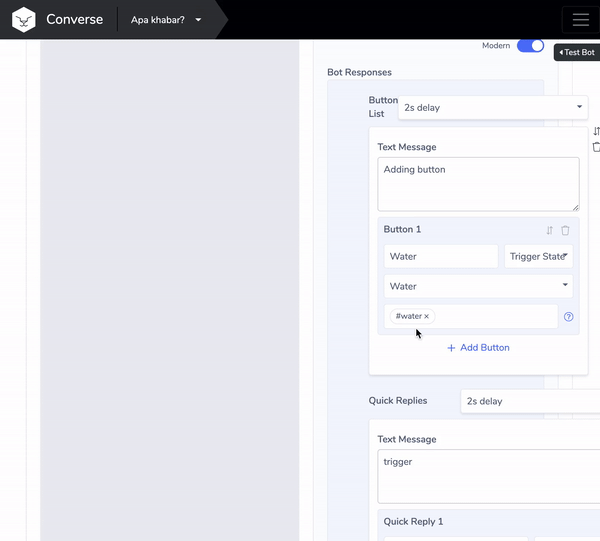

#### **Typing Delay**

Each Component allows you to set a Typing Delay which simulates the Bot typing the response to the user. This delay allows Chat Users to read the previously displayed content before the new Message Component is displayed, and contributes to a better user experience.

#### **Data Collection Block**

Use this configuration to collect data from the Chat User. Data collected is stored in Variables in the [Conversation Context](conversation-context.md), and can be used in following States.

<table>
  <thead>
    <tr>
      <th style="text-align:left"><b>Field Name</b>
      </th>
      <th style="text-align:left"><b>Description</b>
      </th>
    </tr>
  </thead>
  <tbody>
    <tr>
      <td style="text-align:left">Variable</td>
      <td style="text-align:left">Specify the Variable Name to store the value captured from the user input.</td>
    </tr>
    <tr>
      <td style="text-align:left">Variable Type</td>
      <td style="text-align:left">
        
This is the type of the variable that validates and restricts the user
          input to specific types: Date, Number, and File.

        <ul>
          <li>Number: Displays a number picker</li>
          <li>Date: Displays a date picker</li>
          <li>File: Displays a file picker
            <ul>
              <li>Note: Processing of uploaded files currently requires TAIGER customization
                effort. Please contact us if you&apos;d like to use this functionality.</li>
            </ul>
          </li>
        </ul>
      </td>
    </tr>
    <tr>
      <td style="text-align:left">Validation Type</td>
      <td style="text-align:left">
        
Validation type Indicates the type of validation to be applied on the
          user&apos;s input.

        
There are 5 possible validation types to choose from.

        <ol>
          <li>Number</li>
          <li>Date (DD/MM/YYYY)</li>
          <li>Date (MM/DD/YYYY)</li>
          <li>Email</li>
          <li>External Service - Use an External API service to validate the user&apos;s
            input (see <a href="../../advanced/data-integrations.md#configuring-a-webhook-connector">Configuring a Webhook Connector</a>)</li>
        </ol>
        
For each of these types the following configuration options are provided:

        <ul>
          <li><b>Max Validation Attempts:</b> Specifies the number of times to try before
            triggering the <em>ValidationAttemptExceeded</em> State. This is to prevent
            the system from infinitely &quot;looping&quot;.</li>
          <li><b>Validation Attempts Exceeded State:</b> Specify the State to be triggered
            if the user exceeds the Max Validation Attempts. Use this State to provide
            more instruction to the Chat User, prompt the user to try again, or direct
            them to another Intent Dialog Flow.</li>
          <li> <b>Validation Message:</b> This is the message that will be triggered each
            time the user enters an input that fails the validation check, while within
            the Max Validation Attempts count.</li>
        </ul>
      </td>
    </tr>
    <tr>
      <td style="text-align:left">Validation Attempt (if validation type is selected)</td>
      <td style="text-align:left">
        
Specify the number of attempts allowed.

        <ul>
          <li>Maximum Attempts &#x2013; The number of attempts allowed for user input.</li>
          <li>Select Validation Attempt Exceeded State - The state that is displayed
            after the maximum number of has been exceeded.</li>
        </ul>
      </td>
    </tr>
    <tr>
      <td style="text-align:left">
        
Validation Message

        
(if validation type is selected)

      </td>
      <td style="text-align:left">The message being displayed to the user if the value submitted is invalid.</td>
    </tr>
  </tbody>
</table>

<table>
  <thead>
    <tr>
      <th style="text-align:left">
        
<b>Basic Usage Example:</b>
        

        
<b>Scenario Collecting Email from a User</b>
        

      </th>
      <th style="text-align:left"></th>
    </tr>
  </thead>
  <tbody>
    <tr>
      <td style="text-align:left">This configuration will store the Email in the <b>userEmail</b> variable</td>
      <td
      style="text-align:left">
        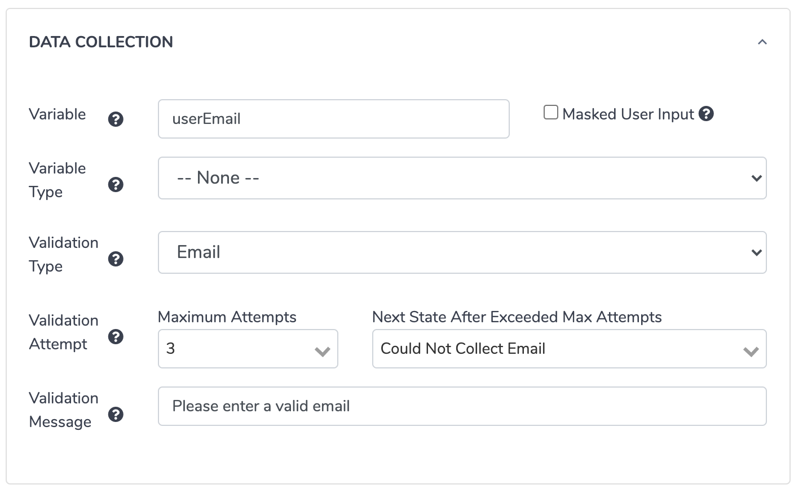
        </td>
    </tr>
    <tr>
      <td style="text-align:left">
        
In the following State, The you can utilize the stored Variable in the
          Content Editor by using the syntax:

        
<b><code>%(answers.VariableName)</code></b>
        

      </td>
      <td style="text-align:left">
        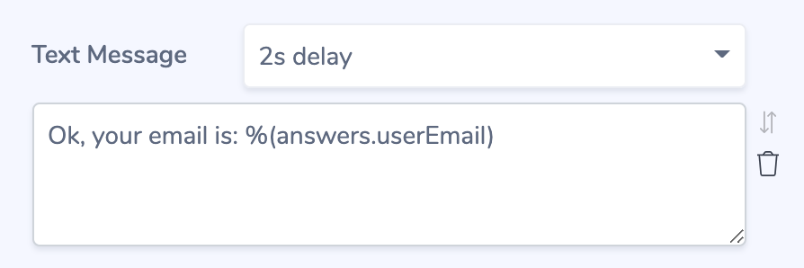
      </td>
    </tr>
  </tbody>
</table>

#### **Transitions Block**

Transitions define Conditions that are required to trigger a specific State.

It allows the Bot to "decide" what the next response should be, depending on the user input or the data currently in the [Conversation Context](conversation-context.md).

**Order of Execution**

Transitions are executed in the same order which they are displayed \(from top to bottom\).

One way to understand it is in terms of **if… then** _**rules**_, as in:

> **IF** the chat user inputs &lt;concept&gt; **THEN** do &lt;action&gt;

**Transition Types**

<table>
  <thead>
    <tr>
      <th style="text-align:left"><b>Transition Type</b>
      </th>
      <th style="text-align:left"><b>Example</b>
      </th>
      <th style="text-align:left"><b>What it means</b>
      </th>
    </tr>
  </thead>
  <tbody>
    <tr>
      <td style="text-align:left">User Input</td>
      <td style="text-align:left">
        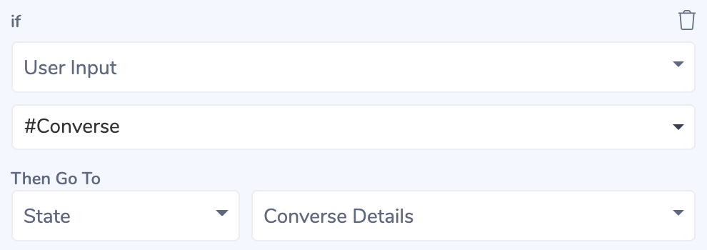
      </td>
      <td style="text-align:left">
        
<b>IF</b> the chat user says &lt;Converse or something with the same meaning&gt;
          :

        <ul>
          <li><b>THEN</b> trigger the State with name &quot;Converse Details&quot;</li>
        </ul>
      </td>
    </tr>
    <tr>
      <td style="text-align:left">Context</td>
      <td style="text-align:left">
        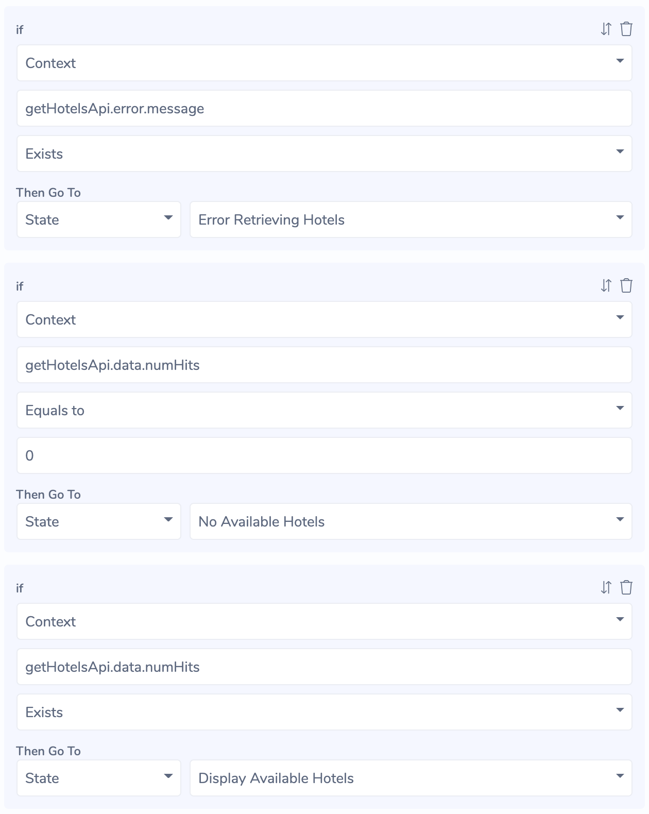
      </td>
      <td style="text-align:left">
        
<b>IF</b> the Service Call returned an error message

        <ul>
          <li><b>THEN</b> trigger the State &quot;Display Error Retrieving Hotels&quot;</li>
        </ul>
        
<b>ELSE IF</b> the <em>numHits</em> data property in the <em>getHotelsApi</em> Service
          call is exactly &quot;0&quot;:

        <ul>
          <li><b>THEN</b> trigger the State &quot;No Available Hotels&quot;</li>
        </ul>
        
<b>ELSE IF</b> the <em>numHits</em> data property in the <em>getHotelsApi</em> Service
          call exists:

        <ul>
          <li><b>THEN</b> trigger the State &quot;Display Available Hotels&quot;</li>
        </ul>
        
Available Comparisons*

        <ul>
          <li>Is true</li>
          <li>Is false</li>
          <li>Exists</li>
          <li>Equals to</li>
          <li>Not Equals to</li>
          <li>Contains</li>
        </ul>
      </td>
    </tr>
    <tr>
      <td style="text-align:left">Fallback</td>
      <td style="text-align:left">
        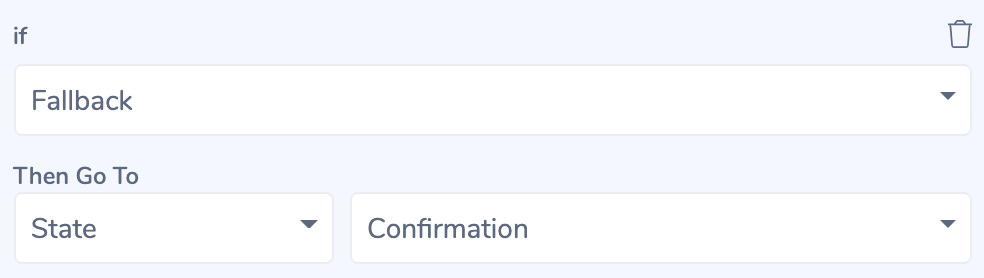
      </td>
      <td style="text-align:left">
        
<b>IF</b> none of the Transitions in the State triggered

        <ul>
          <li><b>THEN</b> trigger the State &quot;Confirmation&quot;</li>
        </ul>
      </td>
    </tr>
  </tbody>
</table>

\*For Information for Middleware Plugin Developers:

Only String Comparisons are supported. For Numeric value, convert it into a text value first \(i.e. 0 becomes "0"\). For Boolean values, convert it into text value \(i.e. "true" or "false"\).

Transition Actions

Transitions can lead Chat Users to a State within the same Intent Flow, or trigger another Intent entirely. In the input field under the "Then Go To" label, Bot Admins can select either State or Intent to select which Action the Transition should take.

**Set Context Action Block**

Set Context Action allows Bot Admins to set new or existing Variables in the Context.

Context Variables can then be used in Transition's conditions, sent to external services via Service Action, or inserted into Message Components to be displayed to Chat Users.

If the Context Variable already exists, then the value it holds will be overwritten with the new value. If Context Variable does not exist, then it will be created.

<table>
  <thead>
    <tr>
      <th style="text-align:left"><b>Function</b>
      </th>
      <th style="text-align:left"><b>Usage Example</b>
      </th>
    </tr>
  </thead>
  <tbody>
    <tr>
      <td style="text-align:left">
        
Set Context Variable to a Text Value

        
<b>Example:</b>
        

        
Set the variable <em>favouriteCity</em> to the Text value &quot;BALI&quot;

      </td>
      <td style="text-align:left">
        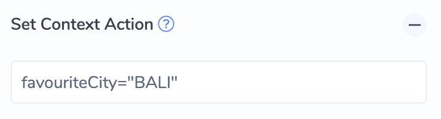
      </td>
    </tr>
    <tr>
      <td style="text-align:left">
        
Set Context Variable to another existing variable (reassignment)

        
<b>Example:</b>
        

        
Set the variable <em>userFirstName</em> to the value in the variable <em>answers.firstName</em>
        

      </td>
      <td style="text-align:left">
        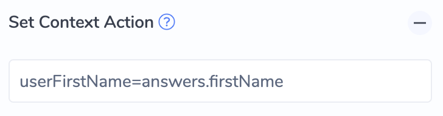
      </td>
    </tr>
  </tbody>
</table>

#### **Dialog Settings**

Dialog Settings allow Bot Admins to configure advanced dialog behaviors. These settings change the way the Dialog Engine behaves for the specific state.

<table>
  <thead>
    <tr>
      <th style="text-align:left">Field</th>
      <th style="text-align:left">Description</th>
    </tr>
  </thead>
  <tbody>
    <tr>
      <td style="text-align:left">Jump Intent</td>
      <td style="text-align:left">
        
If this is configured, then when this State is triggered, the Chat User
          is brought to the specified Intent&apos;s Flow.

        
We recommend using Trigger Intent functionality found in Button/QuickReply
          and Transitions (available in v2.6.0+).

        
Important Notes:

        <ul>
          <li>If Jump is setup, the Content configuration in the State is <b>ignored</b>
          </li>
          <li>If the Jump destination Intent must be ACTIVE. If it becomes INACTIVE/ARCHIVED,
            the Jump will not process, and the Chat User will stay in the current Intent&apos;s
            Dialog Flow.</li>
        </ul>
      </td>
    </tr>
    <tr>
      <td style="text-align:left">Ready to Reply</td>
      <td style="text-align:left">
        
Default Value: <b>true</b>
        

        
&lt;b&gt;&lt;/b&gt;

        
If true:

        <ul>
          <li>The State&apos;s Content field will be returned as a reply to the Chat
            User</li>
          <li>If there were any preceding States that have not sent their Content to
            the user, their Content will be prepended to this State.</li>
        </ul>
        
If false:

        <ul>
          <li>The dialog will proceed to the next State without sending the State&apos;s
            Content to the Chat User.</li>
        </ul>
      </td>
    </tr>
    <tr>
      <td style="text-align:left">Advance</td>
      <td style="text-align:left">
        
Default Value: <b>true</b>
        

        
Indicates whether the dialog engine should advance to the next State or
          stay in the current state.

      </td>
    </tr>
  </tbody>
</table>

