# Libraries and Intent Management

## What is an Intent?

An Intent is a fundamental unit in Converse. It represents a piece of information the users can ask for, contains associated answers, and a part of a dialog. It is an intention conveyed in a user message which triggers some action. Each intent triggers a direct answer or guided conversational flow. A guided conversational flow is a series of actions linked together with a set of conditions and triggers another state of action.

## What is a Library?

Libraries are similar to folders where Intents can be kept and organized. You can create new Libraries at any time, and move Intents between them.

It is good practice to name Libraries based on sub-domains of knowledge. For example, a Bot covering the Human Resources domain, there may be Libraries for Recruitment, Onboarding, Leave Policy, and so on.

## Intent Dashboard Overview

Intent Dashboard is the area where intents and libraries are displayed. This is where you can manage the intents assigned to your own bot.

It is divided into 3 main sections:

1. Bot Selector
2. Libraries Side Panel
3. Management and Teaching View

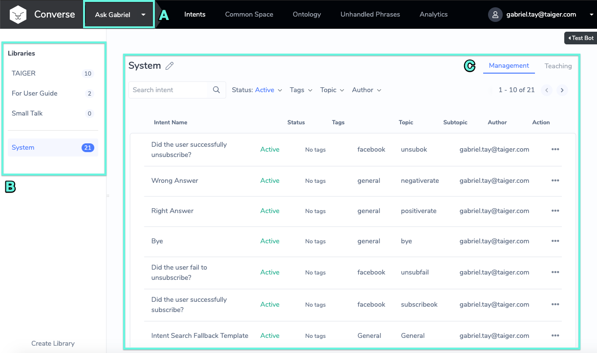

#### **A\) Bot Selector**

Bot Selector is located on the top left side of the navigation bar. It allows you to select the current active bot. Once the bot is selected, it will filter the available libraries assigned to your bot.

Select a _Current Active Bot_

* Displays current active Bot which you have Owner and Edit permissions
* Displays a list of libraries linked to the current active Bot

#### **B\) Libraries Side Panel**

This is where the list of libraries and number of intents assigned to the Current Active Bot can be seen.

## Library Management

### Create Library

You can create a new Library by clicking on the  button in the **Libraries Side Panel**. The following Popup will appear:

<table>
  <thead>
    <tr>
      <th style="text-align:left">
        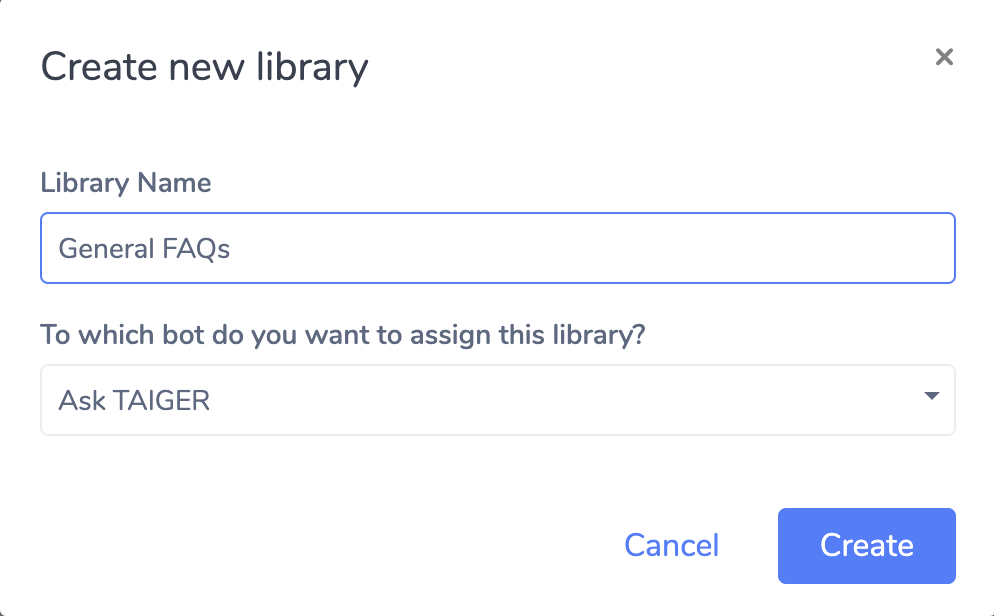
      </th>
      <th style="text-align:left">
        
Enter Library Name (required)

        
Select the Bot you want to create the Library for.

        
Click &quot;Create&quot;

      </th>
    </tr>
  </thead>
  <tbody>
    <tr>
      <td style="text-align:left">
        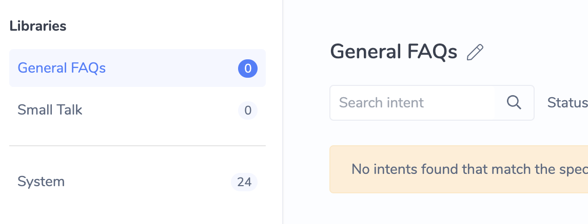
      </td>
      <td style="text-align:left">Then, the new Library will be created and displayed on the <em>Library Side Panel</em>
      </td>
    </tr>
  </tbody>
</table>

### Default Libraries

When a Bot is first created, there will be 2 Default Libraries preloaded.

1. System Library
2. Smalltalk Library

### "System" Library - Configuring Default System Responses

This Library contains special Intents which are automatically triggered by Converse to support default system behaviour \(e.g. Initial ‘Hello’ message\).

Here are some of the important System Intents you should know:

<table>
  <thead>
    <tr>
      <th style="text-align:left"><b>Intent Name</b>
      </th>
      <th style="text-align:left"><b>When is it triggered?</b>
      </th>
    </tr>
  </thead>
  <tbody>
    <tr>
      <td style="text-align:left">Hello</td>
      <td style="text-align:left">When a first-time user opens the chat interface</td>
    </tr>
    <tr>
      <td style="text-align:left">Hello again</td>
      <td style="text-align:left">When a returning user opens the chat interface</td>
    </tr>
    <tr>
      <td style="text-align:left">NoInfo</td>
      <td style="text-align:left">When the Bot was not able to understand the user&#x2019;s Intent for the
        first time</td>
    </tr>
    <tr>
      <td style="text-align:left">NoInfo2</td>
      <td style="text-align:left">Following NoInfo, the Bot was not able to understand the user for the
        second time in a row</td>
    </tr>
    <tr>
      <td style="text-align:left">Escalate</td>
      <td style="text-align:left">
        
Following NoInfo2, the Bot was not able to understand the user for the
          third time in a row

        <ul>
          <li>Note: At this point, it is best practice to point the user towards some
            other means of getting help</li>
        </ul>
      </td>
    </tr>
    <tr>
      <td style="text-align:left">Bye</td>
      <td style="text-align:left">The intent that is triggered when the user says &quot;Bye&quot; or similar,
        or ends the conversation through any other means</td>
    </tr>
    <tr>
      <td style="text-align:left">Intent Search Fallback Template</td>
      <td style="text-align:left">This intent will be triggered when NLU Intent Matcher yielded low-confidence
        results.</td>
    </tr>
    <tr>
      <td style="text-align:left">WhatAbout Template</td>
      <td style="text-align:left">This intent is triggered when the user entered a topic based input, which
        matched one of the Topic Tags in the Bot&apos;s Ontology Knowledge Base</td>
    </tr>
  </tbody>
</table>

#### "Smalltalk" Library

This Library contains a set of generic responses for common user inputs like

* "Who are you?"
* "Who made you?"
* "Are you a boy or a girl?"

By default, these Intents will be Deactivated. You can quickly activate them in bulk using the Bulk Intent Status Update function \(see [Bulk Change Intent Status](libraries-and-intent-management.md#bulk-change-intent-status)\)

## Management View

This is where the list of Intents of a selected library is displayed. In this area, you can manage and filter the intents, as well as to perform various actions such as create, edit, activate, deactivate, archive, unarchive and delete.

### Filter Intents in a Library

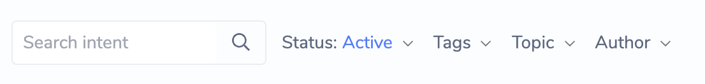

#### **Filter Intent by text search**

Enter any text in the text field to filter an Intent by text. The following Intent's properties will be searched:

* Intent Name
* All the Training Phrases of the Intent

#### **Filter Intents by Status**

By default, the system will filter for only _Active_ Intents. Other options include:

* Inactive
* Active and Inactive
* Archived

#### **Filter Intents by Tags**

* Tags allow you to organize your Intents by topic terms that are meaningful to you. To learn how to Tag Intents, see [Bulk Update Intents Tags](libraries-and-intent-management.md#bulk-update-intents-tags)
* Select the Tag that you want to filter Intents by clicking on the checkbox beside the tag
* You can select more than one tag to filter for at one go

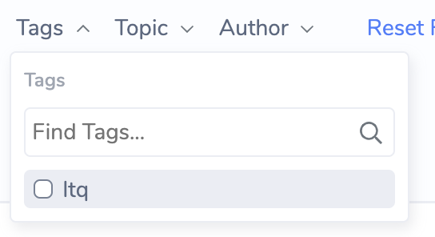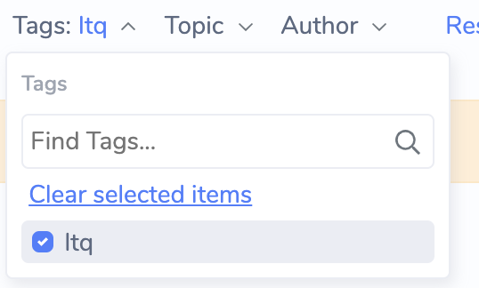

#### **Reset Filters**

Click Reset Filters to reset all Filters to their default setting.

### Bulk Update Intents

#### **Bulk Select Intents for Update**

* Use the checkboxes on each Intent row to select the Intent for update

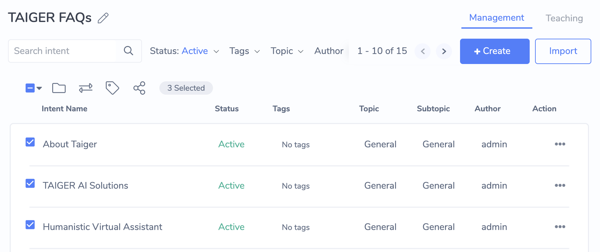

* You can also select All Intents on the Current Page, or All the Intents in the Library

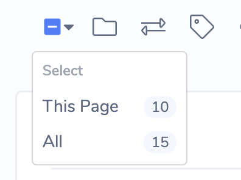

#### **Bulk Move Intents**

* To move the selected Intents, click on the Folder  icon
* In the popup that appears, select the Destination Library for the Intents

#### **Bulk Change Intent Status**

* Click on the  Icon to change the selected Intents statuses
* In the popup that appears, select the Target Status for the Intents
* Click Update

#### **Bulk Update Intents Tags**

* Click on the  icon to tag the selected Intents
* In the popup that appears:
  * Add Tags: Search for Tags to add, then press enter
  * Remove Tags: Click on the 'x' button in the Existing Tags section. Note: this will only remove Tags from Intents that had the Tag to begin with.
* Now click on the Apply
* The Updated Tags should be visible in the Intent Dashboard, in the Tags column

#### Bulk Import Q&A via Excel

You can bulk import Q&A using an Excel document to existing libraries by clicking  under Intent Dashboard &gt; Management View. This will generate the Intents and Phrases

Before proceeding you should prepare an Excel document with the following columns, adding your own Q&A into each row of the spreadsheet. A sample Q&A is provided in the example below:

<table>
  <thead>
    <tr>
      <th style="text-align:left">Question</th>
      <th style="text-align:left">Answer</th>
      <th style="text-align:left">Phrase</th>
    </tr>
  </thead>
  <tbody>
    <tr>
      <td style="text-align:left">What are your opening hours?</td>
      <td style="text-align:left">Our opening hours are 9am to 6pm, Monday to Friday.</td>
      <td style="text-align:left">
        
What are your opening hours?

        
When can I visit your office?

        
Another question variation

        
Yet another question variation

      </td>
    </tr>
  </tbody>
</table>

Notes:

* Ensure that column headers are exactly the same as the table above
* Specify each unique question variation on it's own line
* Each Q&A must have Question, Answer and at least one Phrase

### **Import Intents via Excel**

1. Select Library you wish to import into from the Library Side Panel.
2. Click on the  button. The Import popup for configuration and excel uploading will be displayed.

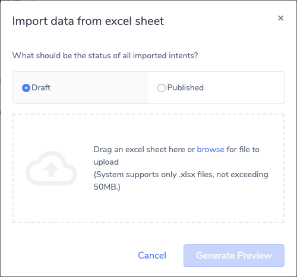

1. Select the status of the Intent after the import is complete.
2. Draft - the Content only accessible on the Admin Chat UI, and is not visible to the Public
3. Published - the Intent is immediately available for use on the Public Chat UI
4. Drag the Excel file containing the Q&A into the dotted box outline or click browse to upload the file.

Before you upload a file:

* Ensure the content label is always present at the top of the column. For example, “Question”.
* Ensure that the content label form has not been changed.
* Ensure not to upload an empty document.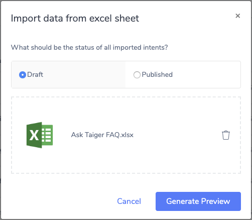
* Click . A new window displays the following:
* Bulk Import displays the uploaded excel file
* Intents imported with conflicting question text with other intents
* Preview of the list of imported intents for review

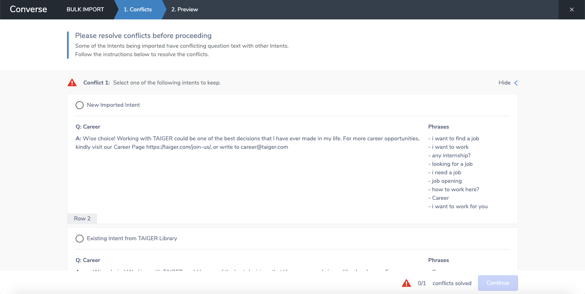

1. If there are conflicting question text with other intents, follow the instructions to resolve the conflicts.

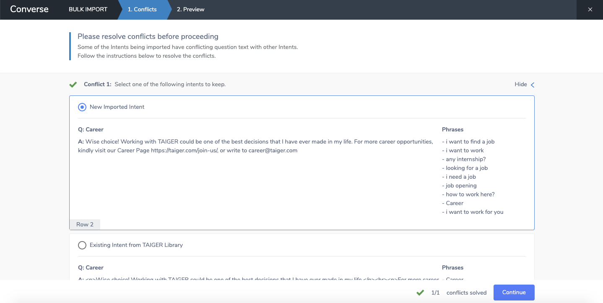

1. Click Continue.
2. Review the content that you want to add in the library.

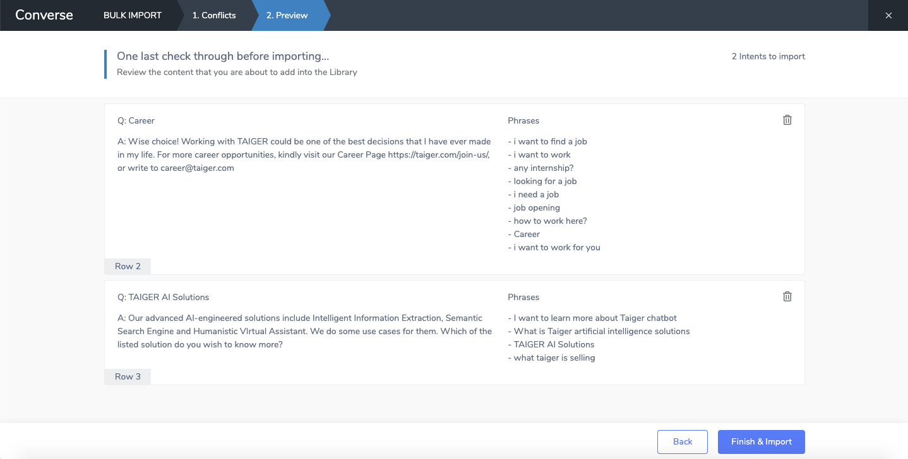

1. A "Creating Intent" notification banner appears while the intents are being imported. Once done, the banner will disappear and your Intents would be imported successfully. 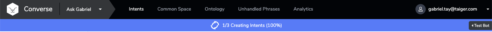

## Teaching View

The Teaching View is where you can train the bot with various phrases to match user’s utterances. Adding phrases is an alternative way of training the bot to ask questions or to understand a new form of questions.

In this view, displays a list of all the questions, answers, and added phrases that belong to that intent. You can also Teach the Bot to understand new variations of user input using the Teaching Tool.

Usage of the Teaching Tool and related functions is explored in depth in [Teaching Your Bot](teaching-your-bot.md).

