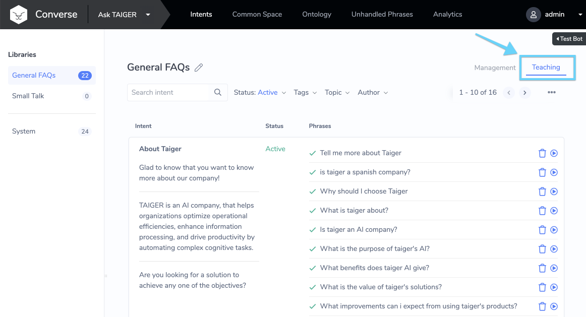
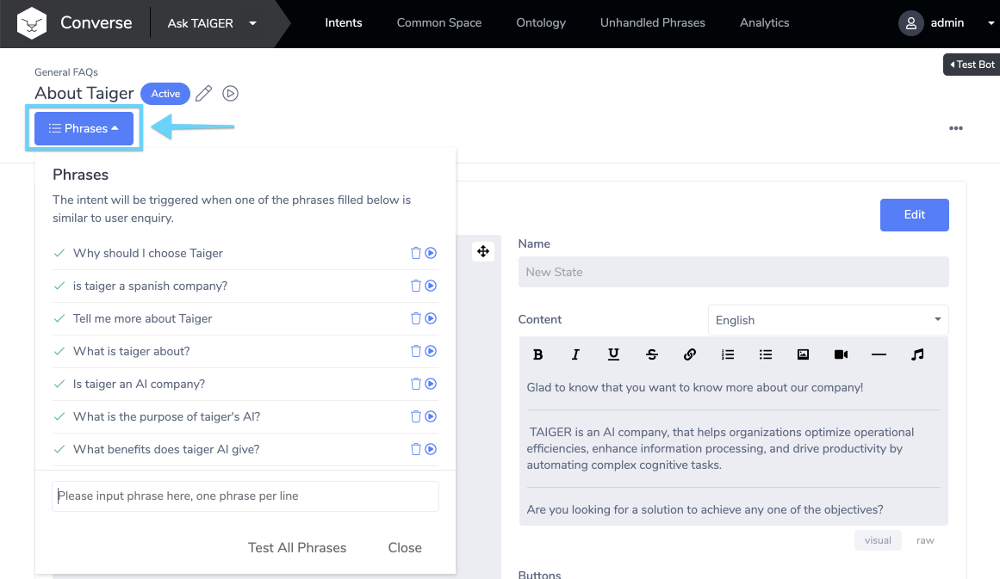
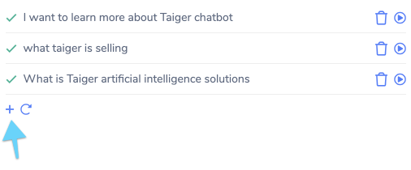
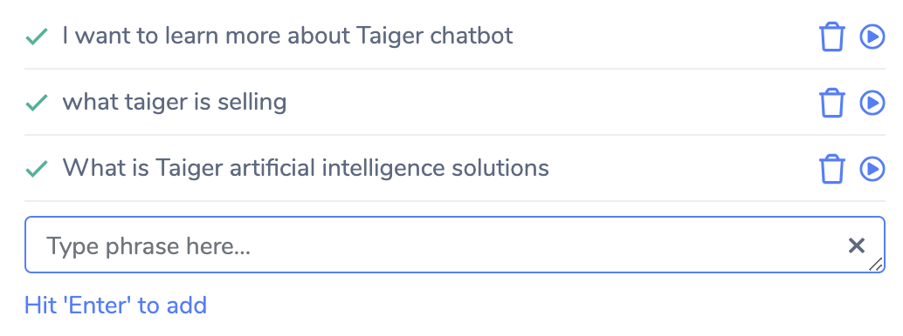
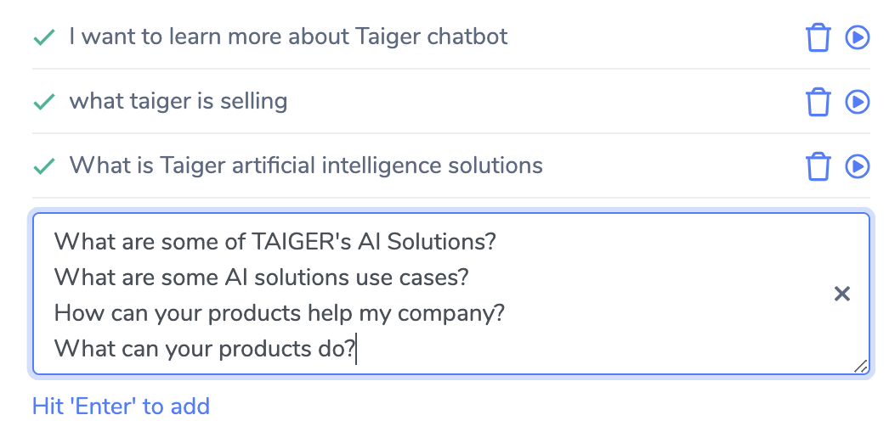
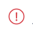
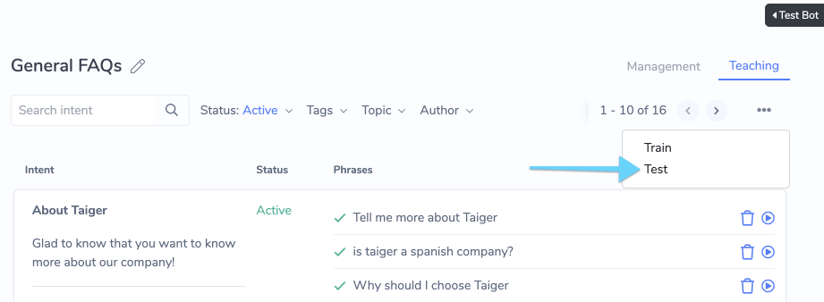
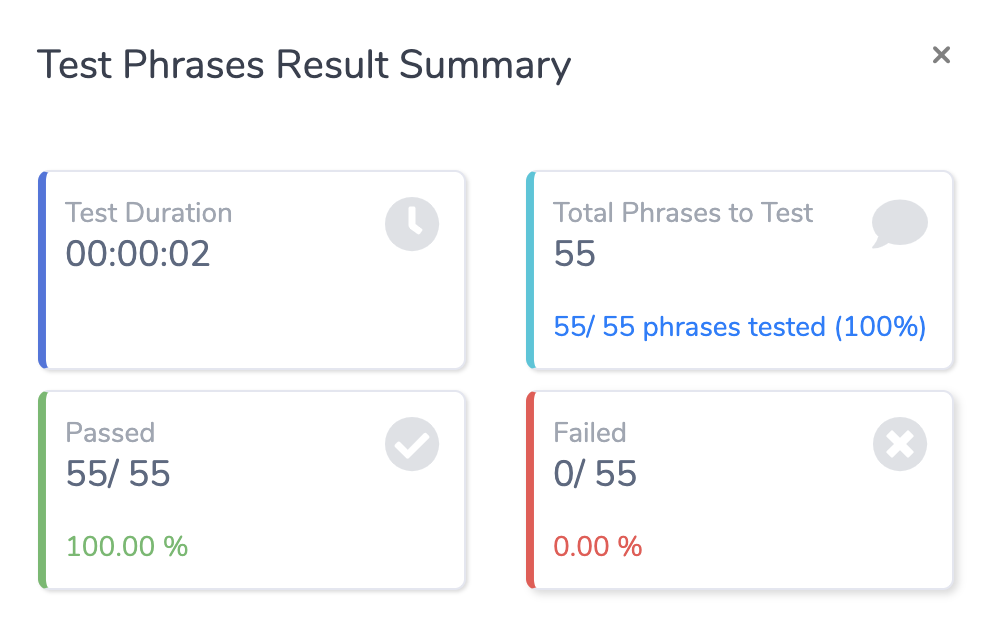
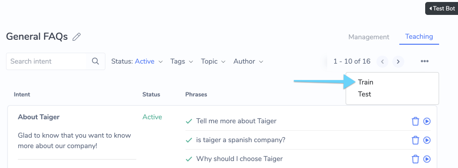
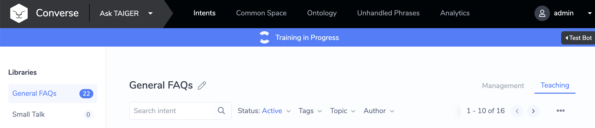

# Teaching Your Bot

## Accessing the Teaching Tool

**Navigating to the Teaching Tool**

The Teaching Tool can be found at two places:

1\) In the Intent Dashboard, select the "Teaching" tab on the top right of the screen.

2\) In the Intent Editor, Click on the "Phrases" button on the top left of the screen.

## Adding and Deleting Phrases

Usage of the Teaching Tool in the Intent Dashboard and the Intent Editor is very similar.

**Toggle the Phrase Input Field \(only for Intent Dashboard's Teaching Tool\)**

From the Intent Dashboard, the Phrase Input Field is hidden by default, so you need to toggle it by clicking on the "+" button. This step is not required for the Teaching Tool inside the Intent Editor because the Phrase Input Field is open by default.

**Add Phrases**

With the Phrase Input Field open, you can start adding Phrases.

You can add multiple phrases at one go by having one phrase on each line.

Once you are done, press "Enter" on your keyboard and the phrases will be added sequentially to the Intent.

Note: It is recommended to have at least 10 Phrases per Intent. See [Best Practices To Improve Intent Matching Accuracy](teaching-your-bot.md#best-practices-to-improve-intent-matching-accuracy).

**Deleting Phrases**

To delete a phrase, click on the trash bin icon beside the Phrase.

## Phrase Status Indicator

This indicates whether or not the Phrase is correctly triggering the Intent.

When a Phrase is added, it is automatically Tested, and the Phrase Status Indicator is updated.

Here are the available statuses and their meanings:

<table>
  <thead>
    <tr>
      <th style="text-align:left"><b>Status</b>
      </th>
      <th style="text-align:left"><b>Icon</b>
      </th>
      <th style="text-align:left"><b>Description</b>
      </th>
    </tr>
  </thead>
  <tbody>
    <tr>
      <td style="text-align:left">Pass</td>
      <td style="text-align:left">
        
      </td>
      <td style="text-align:left">The Phrase is working as expected. No action is necessary.</td>
    </tr>
    <tr>
      <td style="text-align:left">Not Tested Yet</td>
      <td style="text-align:left">
        
      </td>
      <td style="text-align:left">
        
The Phrase is not yet tested. This can happen if the Phrase was added
          automatically through other processes.

        
Action: Click &quot;Test All Phrases&quot; to manually test the phrases

      </td>
    </tr>
    <tr>
      <td style="text-align:left">Conflict</td>
      <td style="text-align:left">
        
      </td>
      <td style="text-align:left">
        
The Phrase is triggering the wrong Intent. This should never happen if
          the system is working correctly.

        
Steps to rectify: Click &quot;Test All Phrases&quot; and see if the Status
          was updated incorrectly. If the error persists, please contact your administrator.

      </td>
    </tr>
  </tbody>
</table>

## Testing Phrases

**Test Phrases For An Intent**

Testing Phrases will update the Phrase Status Indicator, and is useful for a quick health-check for that Intent.

**Test All Bot Phrases**

You can also run a Bot-level health check which will test all Phrases for all the Intents in the Current Active Bot. To access this function:

1. Navigate to the Intent Dashboard &gt; Teaching tab
2. Click on the '...' icon on the top right side of the page, under the Teaching Tab element
3. In the menu that appears, click on the "Test" option

This will start the Testing Process, and a popup will appear that summarizes the results in real time:

## Training Your Bot

After you have finished adding Phrases to your Intents, it is time to Train your Bot. This allows your Bot to learn from the Phrases added and generalize better and handle even more variations of user input. This means you don't need to think of all the possible variations - Converse automatically handles them for you.

Note: Depending on the number of Intents & Phrases added to your Bot, this process can take several minutes to complete. It is best to Train your bot once you are done with Phrase changes for your work session.

To start the Training Process:

1. Navigate to the Intent Dashboard &gt; Teaching tab
2. Click on the '...' icon on the top right side of the page, under the Teaching Tab element
3. In the menu that appears, click on the "Train" option

1. A "Training in Progress" banner appears while the training process is running. Once done, the banner will disappear.

## Best Practices To Improve Intent Matching Accuracy

Do’s

* Recommended for higher accuracy: 10 or more phrases. Minimum: 7 phrases
* Ensure that each Intent has about the same number of Phrases. Having some intents with very few phrases will skew the AI's understanding of the Intents
* Express questions, NOT keywords \(“How can I contact you” vs “contact you”\)
  * Unless your users ask questions using keywords – do study conversation logs to determine this
* **Make real variations!** Use a combination of synonyms and differing sentence structures to express the same question
* Visualize the target audience – how will they ask questions?
* Play “Jeopardy”! – Try to guess the question by looking only at the Answer

Don’ts

* Phrase questions in a way that is too similar to an existing Intent
* Use filler words: \(e.g. “hello, I would like to…”\)

