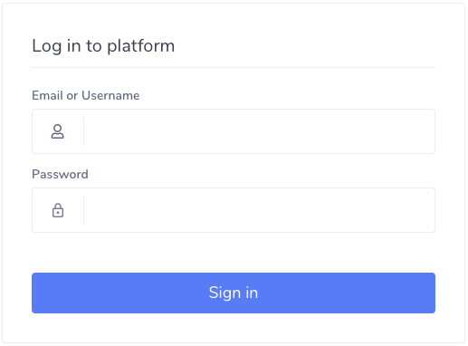
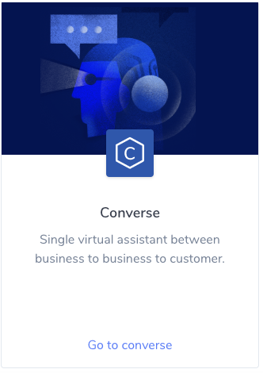
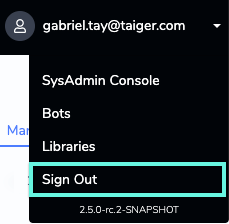

# Accessing Converse

Omnitive Converse is a web-based application which enables Bot Admin to develop conversational Chatbots. A Chatbot will be able to provide answers to common queries, and also to complete simple workflows on behalf of the users.

## Signing In

To sign in:

1. Open the browser to access the application.
2. Enter your login credentials.
3. Click **Sign in**.
4. Select the Converse Product Card.

_**Note:**_ _To reset password, click_ _**Did you forget your password?**. The user receives an email notification to reset the password._

## Signing Out

To sign out:

1. Click on your user profile on the top-right corner and click Sign out.

## Supported Browsers

Omnitive Converse requires an up-to-date web browser. Converse currently supports the latest two versions of all browsers, unless otherwise noted.

For best results, use Omnitive Converse in the latest version of Google Chrome.

Browsers supported include:

* Google Chrome
* Internet Explorer
* Mozilla Firefox 
* Apple Safari

